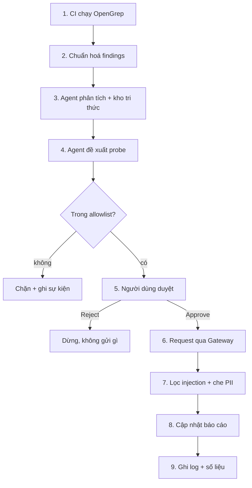

# Plan 4 — Tuần 6 phần trình diễn: web app, tài liệu, demo

> **For agentic workers:** REQUIRED SUB-SKILL: Use superpowers:subagent-driven-development (recommended) or superpowers:executing-plans to implement this plan task-by-task. Steps use checkbox (`- [ ]`) syntax for tracking.

**Goal:** Dựng web app bảy màn hình trên nền orchestrator đã có, đóng gói bằng Docker Compose, viết đủ bộ tài liệu đề bài yêu cầu, và chuẩn bị kịch bản demo 15 phút diễn được cả bảy hạng mục bắt buộc.

**Architecture:** Web là **mặt tiền mỏng**, không chứa một dòng logic pipeline nào. Nó chỉ làm hai việc: đọc artifact trong `artifacts/runs/<id>/` để render, và gọi `orchestrator.create_run` / `execute_run` / `resume_run` trong tiến trình nền. Trạng thái nằm trên đĩa, trình duyệt poll `GET /api/runs/{id}` mỗi giây — không WebSocket, không SSE, không coroutine bị treo.

**Tech Stack:** FastAPI + Jinja2 + CSS tự viết. Form HTML thuần. Không React, không npm, không bước build, không CDN.

**Spec:** [`docs/superpowers/specs/2026-08-17-sentinel-rebuild-design.md`](../specs/2026-08-17-sentinel-rebuild-design.md) — mục 11.3, 11.5, 11.6.

**Tiền đề:** Plan 1, 2, 3 đã xong. Có `orchestrator/` với `start_run`, `resume_run`, `load_run`, `list_runs`, `collect_metrics`, `RunContext`, `RunState`, `STEP_NAMES`.

## Global Constraints

- Python `>=3.10`; CI chạy Python 3.12.
- **Không mock, stub, hay fake.** Test không tới được phụ thuộc thì **fail**, không bao giờ `skip`.
- Không commit `.env`, không in secret ra log hay stdout. **Web không bao giờ hiển thị API key.**
- Không sửa hay xoá `reports/week-01/` đến `reports/week-04/`.
- **Không CDN, không tài nguyên ngoài.** Phòng demo có thể mất mạng.
- **Web không chứa logic pipeline.** Mọi thay đổi trạng thái đều đi qua `orchestrator/`.
- **Đóng băng ở bảy màn hình.** Không thêm màn hình nào ngoài danh sách trong spec.
- Target cố định là WebGoat. Không làm chức năng cho người dùng trỏ vào repo tuỳ ý.
- Sau khi thêm dependency, chạy lại `uv lock && uv export --locked --extra dev --no-hashes --output-file requirements.txt`.

---

## File Structure

**Tạo mới**

| Đường dẫn | Trách nhiệm |
|---|---|
| `src/project_sentinel/web/__init__.py` | package |
| `src/project_sentinel/web/views.py` | đọc artifact → dict cho template; **chỉ đọc** |
| `src/project_sentinel/web/main.py` | FastAPI app và toàn bộ route |
| `src/project_sentinel/web/templates/*.html` | 8 template (base + 7 màn hình) |
| `src/project_sentinel/web/static/style.css` | CSS tự viết |
| `infra/docker/web/Dockerfile` | thay bản giữ chỗ của Plan 1 |
| `docs/product-brief.md` | bản mô tả sản phẩm 1–2 trang |
| `docs/limitations.md` | rủi ro bảo mật còn tồn tại |
| `docs/demo-script.md` | kịch bản 15 phút |
| `reports/week-05/report.md`, `reports/week-06/report.md` | báo cáo hai tuần cuối |

**Sửa**

`pyproject.toml` · `src/project_sentinel/orchestrator/runner.py` · `docker-compose.yml` · `Makefile` · `README.md` · `docs/architecture.md`

---

## Task 1: Khung web, lớp đọc, và màn hình Overview

**Files:**
- Modify: `pyproject.toml:11-19`
- Create: `src/project_sentinel/web/__init__.py`, `views.py`, `main.py`
- Create: `src/project_sentinel/web/templates/base.html`, `overview.html`
- Create: `src/project_sentinel/web/static/style.css`
- Test: `tests/unit/web/__init__.py`, `tests/unit/web/test_overview.py`

**Interfaces:**
- Consumes: `RunContext`, `list_runs`, `load_run`, `collect_metrics`
- Produces:
  - `views.overview_data(ctx) -> dict` — `{"runs": [...], "totals": {...}, "demo_run": str | None}`
  - `main.app` — FastAPI app
  - `main.get_context() -> RunContext` — điểm ghi đè duy nhất cho test
  - `GET /` → HTML Overview

- [ ] **Step 1: Thêm dependencies**

Sửa `pyproject.toml`:

```toml
dependencies = [
    "jsonschema>=4.0",
    "fastapi>=0.110",
    "uvicorn[standard]>=0.29",
    "jinja2>=3.1",
    "python-multipart>=0.0.9",
]
```

Thêm vào `dev`:

```toml
dev = [
    "pytest>=8.0",
    "pytest-xdist>=3.5",
    "pyyaml>=6.0",
    "httpx>=0.27",
]
```

Run: `uv lock && uv export --locked --extra dev --no-hashes --output-file requirements.txt && python -m pip install -r requirements.txt`

- [ ] **Step 2: Viết test thất bại**

Tạo `tests/unit/web/__init__.py` (rỗng) và `tests/unit/web/test_overview.py`:

```python
"""Màn hình Overview. Web chỉ đọc artifact thật, không dựng dữ liệu giả."""

import json

import pytest
from fastapi.testclient import TestClient

from project_sentinel.orchestrator.context import RunContext
from project_sentinel.orchestrator.state import RunState, new_run, save_run
from project_sentinel.web import main as web_main


@pytest.fixture
def client(tmp_path):
    ctx = RunContext.default().replace(runs_dir=tmp_path / "runs")
    web_main.app.dependency_overrides[web_main.get_context] = lambda: ctx
    yield TestClient(web_main.app), ctx
    web_main.app.dependency_overrides.clear()


def _finished_run(ctx, state=RunState.DONE, findings=3):
    record = new_run(ctx.runs_dir)
    record.state = state
    record.mark_step("scan", "running")
    record.mark_step("scan", "done")
    (record.root / "findings.json").write_text(
        json.dumps({"findings": [{"id": f"f{i}"} for i in range(findings)]}), encoding="utf-8"
    )
    save_run(record)
    return record


def test_overview_returns_html(client):
    http, _ = client
    response = http.get("/")
    assert response.status_code == 200
    assert "text/html" in response.headers["content-type"]


def test_overview_with_no_runs_says_so(client):
    http, _ = client
    assert "Chưa có lần chạy nào" in http.get("/").text


def test_overview_lists_a_finished_run(client):
    http, ctx = client
    record = _finished_run(ctx)
    body = http.get("/").text
    assert record.run_id in body
    assert "DONE" in body


def test_overview_shows_the_finding_count(client):
    http, ctx = client
    _finished_run(ctx, findings=7)
    assert "7" in http.get("/").text


def test_overview_links_to_the_run_screen(client):
    http, ctx = client
    record = _finished_run(ctx)
    assert f'/runs/{record.run_id}' in http.get("/").text


def test_overview_never_shows_a_secret(client, monkeypatch):
    monkeypatch.setenv("SENTINEL_GATEWAY_API_KEY", "f" * 64)
    http, ctx = client
    _finished_run(ctx)
    assert "f" * 64 not in http.get("/").text


def test_stylesheet_is_served_locally(client):
    http, _ = client
    response = http.get("/static/style.css")
    assert response.status_code == 200
    assert "text/css" in response.headers["content-type"]


def test_no_page_references_an_external_host(client):
    """Phòng demo có thể mất mạng; mọi tài nguyên phải là cục bộ."""
    http, ctx = client
    _finished_run(ctx)
    body = http.get("/").text
    for marker in ("https://", "http://cdn", "//cdn."):
        assert marker not in body, f"Trang tham chiếu tài nguyên ngoài: {marker}"
```

- [ ] **Step 3: Chạy test, xác nhận thất bại**

Run: `python -m pytest tests/unit/web/test_overview.py -v`
Expected: FAIL — `project_sentinel.web` chưa tồn tại.

- [ ] **Step 4: Viết `views.py`**

Tạo `src/project_sentinel/web/__init__.py` (rỗng, một dòng docstring) và `src/project_sentinel/web/views.py`:

```python
"""Đọc artifact của các lần chạy và dựng dữ liệu cho template.

Module này CHỈ ĐỌC. Không thay đổi trạng thái, không gọi mạng, không chạy bước
nào. Mọi thay đổi đều thuộc về orchestrator.
"""

from __future__ import annotations

import json
import os
from pathlib import Path
from typing import Any

from project_sentinel.guardrails.events import read_events
from project_sentinel.orchestrator.context import RunContext
from project_sentinel.orchestrator.metrics import collect_metrics
from project_sentinel.orchestrator.run_log import read_log
from project_sentinel.orchestrator.state import RunRecord, list_runs, load_run

MAX_RUNS_ON_OVERVIEW = 20


def _read_json(path: Path, default: Any) -> Any:
    if not path.exists():
        return default
    try:
        return json.loads(path.read_text(encoding="utf-8"))
    except json.JSONDecodeError:
        return default


def _read_jsonl(path: Path) -> list[dict]:
    if not path.exists():
        return []
    return [json.loads(l) for l in path.read_text(encoding="utf-8").splitlines() if l.strip()]


def overview_data(ctx: RunContext) -> dict:
    """Số liệu tổng hợp và danh sách các lần chạy gần đây."""
    rows = []
    totals = {"runs": 0, "findings": 0, "requests": 0, "approved": 0, "rejected": 0, "errors": 0}

    for run_id in list_runs(ctx.runs_dir)[:MAX_RUNS_ON_OVERVIEW]:
        record = load_run(ctx.runs_dir, run_id)
        metrics = collect_metrics(record)
        rows.append({
            "run_id": run_id,
            "state": record.state.value,
            "created_at": record.created_at,
            "findings": metrics["findings_total"],
            "requests": metrics["requests_total"],
            "elapsed_ms": metrics["total_elapsed_ms"],
        })
        totals["runs"] += 1
        totals["findings"] += metrics["findings_total"]
        totals["requests"] += metrics["requests_total"]
        totals["approved"] += metrics["approvals"]["approved"]
        totals["rejected"] += metrics["approvals"]["rejected"]
        totals["errors"] += metrics["errors"]["total"]

    return {
        "runs": rows,
        "totals": totals,
        "demo_run": os.getenv("SENTINEL_DEMO_RUN") or None,
    }


def run_data(ctx: RunContext, run_id: str) -> dict:
    """Tiến trình chín bước của một lần chạy."""
    record = load_run(ctx.runs_dir, run_id)
    return {
        "run": record,
        "steps": [
            {
                "index": step.index,
                "name": step.name,
                "status": step.status,
                "elapsed_ms": step.elapsed_ms,
                "detail": step.detail,
            }
            for step in record.steps
        ],
        "metrics": collect_metrics(record),
        "log": read_log(record.root)[-50:],
    }


def findings_data(ctx: RunContext, run_id: str) -> dict:
    record = load_run(ctx.runs_dir, run_id)
    findings = _read_json(record.root / "findings.json", {}).get("findings", [])
    severities: dict[str, int] = {}
    for item in findings:
        key = str(item.get("severity", "unknown"))
        severities[key] = severities.get(key, 0) + 1
    return {"run": record, "findings": findings, "severities": severities}


def analysis_data(ctx: RunContext, run_id: str) -> dict:
    record = load_run(ctx.runs_dir, run_id)
    return {
        "run": record,
        "records": _read_jsonl(record.root / "analysis.jsonl"),
        "proposal": _read_json(record.root / "proposal.json", {}),
    }


def events_data(ctx: RunContext, run_id: str) -> dict:
    record = load_run(ctx.runs_dir, run_id)
    return {
        "run": record,
        "events": read_events(record.root / "events.jsonl"),
        "scrubbed": _read_json(record.root / "scrubbed.json", {}),
        "proposal": _read_json(record.root / "proposal.json", {}),
    }


def requests_data(ctx: RunContext, run_id: str) -> dict:
    record = load_run(ctx.runs_dir, run_id)
    return {
        "run": record,
        "requests": _read_jsonl(record.root / "gateway-requests.jsonl"),
        "probe_result": _read_json(record.root / "probe-result.json", {}),
    }


def approvals_data(ctx: RunContext) -> dict:
    """Các lần chạy đang chờ người duyệt."""
    pending = []
    for run_id in list_runs(ctx.runs_dir):
        record = load_run(ctx.runs_dir, run_id)
        if record.state.value != "AWAITING_APPROVAL":
            continue
        request = _read_json(record.root / "approval-request.json", None)
        if request:
            pending.append({"run_id": run_id, "request": request})
    return {"pending": pending}


def run_status(ctx: RunContext, run_id: str) -> dict:
    """Trọng tải nhỏ cho polling mỗi giây."""
    record: RunRecord = load_run(ctx.runs_dir, run_id)
    return {
        "run_id": record.run_id,
        "state": record.state.value,
        "error": record.error,
        "terminal": record.state.is_terminal(),
        "steps": [
            {"index": s.index, "name": s.name, "status": s.status, "elapsed_ms": s.elapsed_ms}
            for s in record.steps
        ],
    }
```

- [ ] **Step 5: Viết `main.py` với route Overview**

Tạo `src/project_sentinel/web/main.py`:

```python
"""Mặt tiền web. Không chứa logic pipeline — chỉ đọc artifact và gọi orchestrator."""

from __future__ import annotations

from pathlib import Path

from fastapi import Depends, FastAPI, HTTPException, Request
from fastapi.responses import HTMLResponse
from fastapi.staticfiles import StaticFiles
from fastapi.templating import Jinja2Templates

from project_sentinel.orchestrator.context import RunContext
from project_sentinel.web import views

BASE_DIR = Path(__file__).resolve().parent

app = FastAPI(title="Project Sentinel")
app.mount("/static", StaticFiles(directory=BASE_DIR / "static"), name="static")
templates = Jinja2Templates(directory=str(BASE_DIR / "templates"))


def get_context() -> RunContext:
    """Điểm ghi đè duy nhất cho test."""
    return RunContext.default()


def _render(request: Request, template: str, data: dict) -> HTMLResponse:
    return templates.TemplateResponse(request, template, data)


@app.get("/", response_class=HTMLResponse)
def overview(request: Request, ctx: RunContext = Depends(get_context)):
    return _render(request, "overview.html", views.overview_data(ctx))
```

- [ ] **Step 6: Viết `base.html`**

Tạo `src/project_sentinel/web/templates/base.html`:

```html
<!doctype html>
<html lang="vi">
<head>
  <meta charset="utf-8">
  <meta name="viewport" content="width=device-width, initial-scale=1">
  <title>Project Sentinel</title>
  <link rel="stylesheet" href="/static/style.css">
</head>
<body>
  <header>
    <a class="brand" href="/">Project&nbsp;Sentinel</a>
    
    <nav>
      <a href="/runs/{{ run.run_id }}">Run</a>
      <a href="/runs/{{ run.run_id }}/findings">Findings</a>
      <a href="/runs/{{ run.run_id }}/analysis">Analysis</a>
      <a href="/approvals">Approvals</a>
      <a href="/runs/{{ run.run_id }}/events">Security events</a>
      <a href="/runs/{{ run.run_id }}/requests">Requests</a>
    </nav>
    
  </header>
  <main>
    
  </main>
</body>
</html>
```

- [ ] **Step 7: Viết `overview.html`**

Tạo `src/project_sentinel/web/templates/overview.html`:

```html

Tổng quan — Project Sentinel



<p class="banner">Chế độ demo — lần chạy được ghim: <a href="/runs/{{ demo_run }}">{{ demo_run }}</a></p>


<h1>Tổng quan</h1>

<section class="tiles">
  <div class="tile"><span class="num">{{ totals.runs }}</span><span class="lbl">lần chạy</span></div>
  <div class="tile"><span class="num">{{ totals.findings }}</span><span class="lbl">cảnh báo</span></div>
  <div class="tile"><span class="num">{{ totals.requests }}</span><span class="lbl">request</span></div>
  <div class="tile"><span class="num">{{ totals.approved }}</span><span class="lbl">đã duyệt</span></div>
  <div class="tile"><span class="num">{{ totals.rejected }}</span><span class="lbl">đã từ chối</span></div>
  <div class="tile bad"><span class="num">{{ totals.errors }}</span><span class="lbl">lỗi</span></div>
</section>

<form method="post" action="/runs">
  <button type="submit" class="primary">Quét mã nguồn</button>
</form>

<h2>Các lần chạy</h2>

<p class="muted">Chưa có lần chạy nào.</p>

<table>
  <thead><tr><th>Lần chạy</th><th>Trạng thái</th><th>Cảnh báo</th><th>Request</th><th>Thời gian</th></tr></thead>
  <tbody>
  
    <tr>
      <td><a href="/runs/{{ row.run_id }}">{{ row.run_id }}</a></td>
      <td><span class="state {{ row.state|lower }}">{{ row.state }}</span></td>
      <td>{{ row.findings }}</td>
      <td>{{ row.requests }}</td>
      <td>{{ row.elapsed_ms }} ms</td>
    </tr>
  
  </tbody>
</table>


```

- [ ] **Step 8: Viết `style.css`**

Tạo `src/project_sentinel/web/static/style.css`:

```css
:root {
  --bg: #ffffff; --fg: #1a1d21; --muted: #5c6570; --line: #dfe3e8;
  --card: #f6f8fa; --accent: #1f6feb; --ok: #1a7f37; --warn: #9a6700; --bad: #cf222e;
}
@media (prefers-color-scheme: dark) {
  :root {
    --bg: #0d1117; --fg: #e6edf3; --muted: #8b949e; --line: #30363d;
    --card: #161b22; --accent: #58a6ff; --ok: #3fb950; --warn: #d29922; --bad: #f85149;
  }
}
* { box-sizing: border-box; }
body {
  margin: 0; background: var(--bg); color: var(--fg);
  font: 15px/1.6 system-ui, -apple-system, "Segoe UI", Roboto, sans-serif;
}
header {
  display: flex; align-items: center; gap: 1.5rem; flex-wrap: wrap;
  padding: 1rem 1.5rem; border-bottom: 1px solid var(--line);
}
.brand { font-weight: 700; text-decoration: none; color: var(--fg); }
nav { display: flex; gap: 1rem; flex-wrap: wrap; }
nav a { color: var(--muted); text-decoration: none; }
nav a:hover { color: var(--accent); }
main { max-width: 1100px; margin: 0 auto; padding: 1.5rem; }
h1 { font-size: 1.6rem; } h2 { font-size: 1.2rem; margin-top: 2rem; }
.muted { color: var(--muted); }
.banner {
  background: var(--card); border-left: 3px solid var(--accent);
  padding: .75rem 1rem; border-radius: 4px;
}
.tiles { display: flex; gap: 1rem; flex-wrap: wrap; margin: 1.5rem 0; }
.tile {
  background: var(--card); border: 1px solid var(--line); border-radius: 8px;
  padding: 1rem 1.25rem; min-width: 7rem;
}
.tile .num { display: block; font-size: 1.8rem; font-weight: 700; }
.tile .lbl { color: var(--muted); font-size: .85rem; }
.tile.bad .num { color: var(--bad); }
table { width: 100%; border-collapse: collapse; margin-top: .75rem; }
th, td { text-align: left; padding: .6rem .5rem; border-bottom: 1px solid var(--line); }
th { color: var(--muted); font-weight: 600; font-size: .85rem; }
a { color: var(--accent); }
.state { font-size: .8rem; padding: .15rem .5rem; border-radius: 999px; background: var(--card); }
.state.done { color: var(--ok); } .state.failed, .state.rejected { color: var(--bad); }
.state.awaiting_approval { color: var(--warn); }
button {
  font: inherit; cursor: pointer; border-radius: 6px; padding: .55rem 1.1rem;
  border: 1px solid var(--line); background: var(--card); color: var(--fg);
}
button.primary { background: var(--accent); border-color: var(--accent); color: #fff; }
button.danger { border-color: var(--bad); color: var(--bad); }
.steps { list-style: none; padding: 0; }
.steps li {
  display: flex; align-items: center; gap: .75rem;
  padding: .6rem .75rem; border: 1px solid var(--line);
  border-radius: 6px; margin-bottom: .4rem; background: var(--card);
}
.dot { width: .6rem; height: .6rem; border-radius: 50%; background: var(--muted); flex: none; }
.dot.running { background: var(--warn); } .dot.done { background: var(--ok); }
.dot.failed { background: var(--bad); } .dot.skipped { background: var(--line); }
pre {
  background: var(--card); border: 1px solid var(--line); border-radius: 6px;
  padding: .75rem; overflow-x: auto; font-size: .85rem;
}
.sev-critical, .sev-high { color: var(--bad); font-weight: 600; }
.sev-medium { color: var(--warn); } .sev-low, .sev-info { color: var(--muted); }
.card {
  border: 1px solid var(--line); border-radius: 8px;
  padding: 1rem; margin-bottom: 1rem; background: var(--card);
}
.card.blocked { border-left: 3px solid var(--bad); }
.card.ok { border-left: 3px solid var(--ok); }
```

- [ ] **Step 9: Chạy test, xác nhận xanh**

Run: `python -m pytest tests/unit/web/test_overview.py -v`
Expected: PASS cả 8.

- [ ] **Step 10: Commit**

```bash
git add pyproject.toml uv.lock requirements.txt src/project_sentinel/web/ tests/unit/web/
git commit -m "feat(w6): khung web, lớp đọc artifact, và màn hình Overview

views.py chỉ đọc — không thay đổi trạng thái, không gọi mạng.
CSS tự viết, không CDN, có test khoá việc trang không tham chiếu host ngoài."
```

---

## Task 2: Màn hình Run và API polling

**Files:**
- Modify: `src/project_sentinel/web/main.py`
- Create: `src/project_sentinel/web/templates/run.html`
- Test: `tests/unit/web/test_run_screen.py`

**Interfaces:**
- Consumes: `views.run_data`, `views.run_status`
- Produces: `GET /runs/{run_id}` (HTML), `GET /api/runs/{run_id}` (JSON cho polling 1 giây)

- [ ] **Step 1: Viết test thất bại**

Tạo `tests/unit/web/test_run_screen.py`:

```python
"""Màn hình Run và API polling."""

import pytest
from fastapi.testclient import TestClient

from project_sentinel.orchestrator.context import RunContext
from project_sentinel.orchestrator.state import RunState, new_run, save_run
from project_sentinel.web import main as web_main


@pytest.fixture
def client(tmp_path):
    ctx = RunContext.default().replace(runs_dir=tmp_path / "runs")
    web_main.app.dependency_overrides[web_main.get_context] = lambda: ctx
    yield TestClient(web_main.app), ctx
    web_main.app.dependency_overrides.clear()


def _run_in_progress(ctx):
    record = new_run(ctx.runs_dir)
    record.state = RunState.ANALYZING
    record.mark_step("scan", "running")
    record.mark_step("scan", "done")
    record.mark_step("normalize", "running")
    record.mark_step("normalize", "done")
    record.mark_step("analyze", "running")
    save_run(record)
    return record


def test_run_screen_lists_all_nine_steps(client):
    http, ctx = client
    record = _run_in_progress(ctx)
    body = http.get(f"/runs/{record.run_id}").text
    for name in ("scan", "normalize", "analyze", "propose", "approval",
                 "probe", "scrub", "report", "finalize"):
        assert name in body


def test_run_screen_shows_current_state(client):
    http, ctx = client
    record = _run_in_progress(ctx)
    assert "ANALYZING" in http.get(f"/runs/{record.run_id}").text


def test_unknown_run_returns_404(client):
    http, _ = client
    assert http.get("/runs/20200101T000000Z").status_code == 404


def test_polling_endpoint_returns_compact_json(client):
    http, ctx = client
    record = _run_in_progress(ctx)
    data = http.get(f"/api/runs/{record.run_id}").json()

    assert data["run_id"] == record.run_id
    assert data["state"] == "ANALYZING"
    assert data["terminal"] is False
    assert len(data["steps"]) == 9
    assert data["steps"][0]["status"] == "done"


def test_polling_marks_terminal_states(client):
    http, ctx = client
    record = new_run(ctx.runs_dir)
    record.state = RunState.DONE
    save_run(record)
    assert http.get(f"/api/runs/{record.run_id}").json()["terminal"] is True


def test_polling_on_unknown_run_returns_404(client):
    http, _ = client
    assert http.get("/api/runs/20200101T000000Z").status_code == 404


def test_failed_run_shows_the_error_message(client):
    http, ctx = client
    record = new_run(ctx.runs_dir)
    record.state = RunState.FAILED
    record.error = "Bước scan thất bại (mã 9)"
    save_run(record)
    assert "Bước scan thất bại" in http.get(f"/runs/{record.run_id}").text


def test_awaiting_approval_run_links_to_approvals(client):
    http, ctx = client
    record = new_run(ctx.runs_dir)
    record.state = RunState.AWAITING_APPROVAL
    save_run(record)
    assert "/approvals" in http.get(f"/runs/{record.run_id}").text
```

- [ ] **Step 2: Chạy test, xác nhận thất bại**

Run: `python -m pytest tests/unit/web/test_run_screen.py -v`
Expected: FAIL — hai route chưa tồn tại.

- [ ] **Step 3: Thêm hai route**

Trong `src/project_sentinel/web/main.py`, thêm helper và hai route:

```python
def _load_or_404(loader, *args):
    try:
        return loader(*args)
    except FileNotFoundError:
        raise HTTPException(status_code=404, detail="Không tìm thấy lần chạy")


@app.get("/runs/{run_id}", response_class=HTMLResponse)
def run_screen(request: Request, run_id: str, ctx: RunContext = Depends(get_context)):
    return _render(request, "run.html", _load_or_404(views.run_data, ctx, run_id))


@app.get("/api/runs/{run_id}")
def run_status_api(run_id: str, ctx: RunContext = Depends(get_context)):
    return _load_or_404(views.run_status, ctx, run_id)
```

`load_run` ném `FileNotFoundError` khi thiếu `state.json`, nên helper trên biến nó thành 404.

- [ ] **Step 4: Viết `run.html`**

Tạo `src/project_sentinel/web/templates/run.html`:

```html

Lần chạy {{ run.run_id }}


<h1>Lần chạy <code>{{ run.run_id }}</code></h1>
<p>Trạng thái: <span class="state {{ run.state.value|lower }}" id="state">{{ run.state.value }}</span></p>


<p class="banner" style="border-left-color: var(--bad)">{{ run.error }}</p>



<p class="banner">Đang chờ phê duyệt — <a href="/approvals">mở màn hình Approvals</a></p>


<h2>Tiến trình chín bước</h2>
<ol class="steps" id="steps">
  
  <li>
    <span class="dot {{ step.status }}"></span>
    <strong>{{ step.index }}. {{ step.name }}</strong>
    <span class="muted">{{ step.status }}</span>
    <span class="muted">{{ step.elapsed_ms }} ms</span>
  </li>
  
</ol>

<h2>Số liệu</h2>
<section class="tiles">
  <div class="tile"><span class="num">{{ metrics.findings_total }}</span><span class="lbl">cảnh báo</span></div>
  <div class="tile"><span class="num">{{ metrics.requests_total }}</span><span class="lbl">request</span></div>
  <div class="tile"><span class="num">{{ metrics.approvals.approved }}</span><span class="lbl">duyệt</span></div>
  <div class="tile"><span class="num">{{ metrics.approvals.rejected }}</span><span class="lbl">từ chối</span></div>
  <div class="tile"><span class="num">{{ metrics.total_elapsed_ms }}</span><span class="lbl">ms</span></div>
</section>

<h2>Nhật ký</h2>
<pre>[{{ entry.level }}] {{ entry.step }}: {{ entry.message }}
</pre>

<script>
const runId = {{ run.run_id | tojson }};
async function poll() {
  const response = await fetch(`/api/runs/${runId}`);
  if (!response.ok) return;
  const data = await response.json();
  document.getElementById("state").textContent = data.state;
  const items = document.querySelectorAll("#steps li");
  data.steps.forEach((step, index) => {
    const item = items[index];
    if (!item) return;
    item.querySelector(".dot").className = "dot " + step.status;
    item.querySelectorAll(".muted")[0].textContent = step.status;
  });
  if (!data.terminal && data.state !== "AWAITING_APPROVAL") {
    setTimeout(poll, 1000);
  } else {
    location.reload();
  }
}
if (!{{ run.state.is_terminal() | tojson }} ) { setTimeout(poll, 1000); }
</script>

```

- [ ] **Step 5: Chạy test, xác nhận xanh**

Run: `python -m pytest tests/unit/web/test_run_screen.py -v`
Expected: PASS cả 8.

- [ ] **Step 6: Commit**

```bash
git add src/project_sentinel/web/main.py src/project_sentinel/web/templates/run.html \
        tests/unit/web/test_run_screen.py
git commit -m "feat(w6): màn hình Run và API polling mỗi giây

Polling bằng fetch thuần, không WebSocket, không SSE. Trang tự dừng
poll khi tới trạng thái kết thúc hoặc khi chờ phê duyệt."
```

---

## Task 3: Màn hình Findings và Analysis

**Files:**
- Modify: `src/project_sentinel/web/main.py`
- Create: `src/project_sentinel/web/templates/findings.html`, `analysis.html`
- Test: `tests/unit/web/test_findings_analysis.py`

**Interfaces:**
- Consumes: `views.findings_data`, `views.analysis_data`
- Produces: `GET /runs/{run_id}/findings`, `GET /runs/{run_id}/analysis`

- [ ] **Step 1: Viết test thất bại**

Tạo `tests/unit/web/test_findings_analysis.py`:

```python
"""Hai màn hình đọc: cảnh báo thô và báo cáo của agent."""

import json

import pytest
from fastapi.testclient import TestClient

from project_sentinel.orchestrator.context import RunContext
from project_sentinel.orchestrator.state import new_run, save_run
from project_sentinel.web import main as web_main


@pytest.fixture
def client(tmp_path):
    ctx = RunContext.default().replace(runs_dir=tmp_path / "runs")
    web_main.app.dependency_overrides[web_main.get_context] = lambda: ctx
    yield TestClient(web_main.app), ctx
    web_main.app.dependency_overrides.clear()


@pytest.fixture
def record(client):
    _, ctx = client
    rec = new_run(ctx.runs_dir)
    (rec.root / "findings.json").write_text(json.dumps({"findings": [
        {"id": "f1", "tool": "opengrep", "severity": "high",
         "file_or_url": "src/Login.java", "line": 42, "title": "SQL Injection"},
        {"id": "f2", "tool": "opengrep", "severity": "low",
         "file_or_url": "src/Notes.java", "line": 7, "title": "Weak hash"},
    ]}), encoding="utf-8")
    (rec.root / "analysis.jsonl").write_text(json.dumps({
        "analysis_id": "analysis-aaaa", "title": "SQL Injection qua nối chuỗi",
        "severity": "high", "confidence": "high",
        "explanation": "Truy vấn ghép chuỗi từ dữ liệu người dùng.",
        "remediation": ["Dùng PreparedStatement"],
        "locations": [{"file": "src/Login.java", "line": 42}],
        "evidence": [{"type": "scanner", "finding_id": "f1", "content": "concat in SQL"}],
        "verification_objective": {"description": "Thử chuỗi dài",
                                   "endpoint_hint": "POST /WebGoat/attack",
                                   "payload_kind": "long_string", "rationale": "handler tham so"},
    }) + "\n", encoding="utf-8")
    (rec.root / "proposal.json").write_text(json.dumps({
        "accepted": True, "reason": "allowlist duyệt",
        "probe": {"method": "POST", "path": "/WebGoat/attack", "payload_kind": "long_string"},
        "source_analysis_id": "analysis-aaaa", "objective": None,
    }), encoding="utf-8")
    save_run(rec)
    return rec


def test_findings_screen_lists_every_finding(client, record):
    http, _ = client
    body = http.get(f"/runs/{record.run_id}/findings").text
    assert "SQL Injection" in body
    assert "Weak hash" in body
    assert "src/Login.java" in body


def test_findings_screen_shows_severity_breakdown(client, record):
    http, _ = client
    body = http.get(f"/runs/{record.run_id}/findings").text
    assert "high" in body and "low" in body


def test_findings_screen_with_no_findings_says_so(client):
    http, ctx = client
    empty = new_run(ctx.runs_dir)
    save_run(empty)
    assert "Không có cảnh báo" in http.get(f"/runs/{empty.run_id}/findings").text


def test_analysis_screen_shows_explanation_and_remediation(client, record):
    http, _ = client
    body = http.get(f"/runs/{record.run_id}/analysis").text
    assert "Truy vấn ghép chuỗi" in body
    assert "PreparedStatement" in body


def test_analysis_screen_shows_the_evidence_trail(client, record):
    """Rubric đòi phân tích dựa trên bằng chứng — màn hình phải chiếu được."""
    http, _ = client
    body = http.get(f"/runs/{record.run_id}/analysis").text
    assert "concat in SQL" in body
    assert "src/Login.java" in body


def test_analysis_screen_shows_the_accepted_proposal(client, record):
    http, _ = client
    body = http.get(f"/runs/{record.run_id}/analysis").text
    assert "POST /WebGoat/attack" in body or ("POST" in body and "/WebGoat/attack" in body)


def test_analysis_screen_marks_a_blocked_proposal(client):
    http, ctx = client
    rec = new_run(ctx.runs_dir)
    (rec.root / "analysis.jsonl").write_text("", encoding="utf-8")
    (rec.root / "proposal.json").write_text(json.dumps({
        "accepted": False, "reason": "'GET /WebGoat/admin' không có trong allowlist Gateway.",
        "probe": None, "source_analysis_id": "analysis-bbbb",
        "objective": {"endpoint_hint": "GET /WebGoat/admin"},
    }), encoding="utf-8")
    save_run(rec)

    body = http.get(f"/runs/{rec.run_id}/analysis").text
    assert "không có trong allowlist" in body
    assert "blocked" in body


def test_unknown_run_returns_404_on_both_screens(client):
    http, _ = client
    assert http.get("/runs/20200101T000000Z/findings").status_code == 404
    assert http.get("/runs/20200101T000000Z/analysis").status_code == 404
```

- [ ] **Step 2: Chạy test, xác nhận thất bại**

Run: `python -m pytest tests/unit/web/test_findings_analysis.py -v`
Expected: FAIL — hai route chưa tồn tại.

- [ ] **Step 3: Thêm hai route**

Trong `main.py`:

```python
@app.get("/runs/{run_id}/findings", response_class=HTMLResponse)
def findings_screen(request: Request, run_id: str, ctx: RunContext = Depends(get_context)):
    return _render(request, "findings.html", _load_or_404(views.findings_data, ctx, run_id))


@app.get("/runs/{run_id}/analysis", response_class=HTMLResponse)
def analysis_screen(request: Request, run_id: str, ctx: RunContext = Depends(get_context)):
    return _render(request, "analysis.html", _load_or_404(views.analysis_data, ctx, run_id))
```

- [ ] **Step 4: Viết `findings.html`**

```html

Findings — {{ run.run_id }}

<h1>Cảnh báo từ công cụ quét</h1>

<section class="tiles">
  
  <div class="tile"><span class="num sev-{{ name }}">{{ count }}</span><span class="lbl">{{ name }}</span></div>
  
</section>


<p class="muted">Không có cảnh báo nào trong lần chạy này.</p>

<table>
  <thead><tr><th>Mức</th><th>Tiêu đề</th><th>Vị trí</th><th>Công cụ</th></tr></thead>
  <tbody>
  
    <tr>
      <td class="sev-{{ item.severity }}">{{ item.severity }}</td>
      <td>{{ item.title }}</td>
      <td><code>{{ item.file_or_url }}:{{ item.line }}</code></td>
      <td class="muted">{{ item.tool }}</td>
    </tr>
  
  </tbody>
</table>


```

- [ ] **Step 5: Viết `analysis.html`**

```html

Analysis — {{ run.run_id }}

<h1>Báo cáo của agent</h1>


<p class="muted">Agent chưa sinh báo cáo nào.</p>



<article class="card">
  <h2>{{ item.title }} <span class="sev-{{ item.severity }}">{{ item.severity }}</span></h2>
  <p class="muted">Độ tin cậy: {{ item.confidence }}</p>

  <p><strong>Vị trí:</strong>
  <code>{{ loc.file }}:{{ loc.line }}</code>, </p>

  <p><strong>Giải thích:</strong> {{ item.explanation }}</p>

  <p><strong>Khắc phục:</strong></p>
  <ul><li>{{ fix }}</li></ul>

  <p><strong>Bằng chứng từ công cụ quét:</strong></p>
  <pre>{{ ev.content }}
</pre>
</article>


<h2>Đề xuất kiểm chứng</h2>

<div class="card ok">
  <p>Agent đề xuất: <code>{{ proposal.probe.method }} {{ proposal.probe.path }}</code></p>
  <p class="muted">Payload: {{ proposal.probe.payload_kind or "không có" }} — {{ proposal.reason }}</p>
</div>

<div class="card blocked">
  <p><strong>Đề xuất bị chặn.</strong> {{ proposal.reason }}</p>
  
  <p class="muted">Agent đã đề xuất: <code>{{ proposal.objective.endpoint_hint }}</code></p>
  
</div>

<p class="muted">Chưa có đề xuất nào.</p>


```

- [ ] **Step 6: Chạy test, xác nhận xanh**

Run: `python -m pytest tests/unit/web/test_findings_analysis.py -v`
Expected: PASS cả 8.

- [ ] **Step 7: Commit**

```bash
git add src/project_sentinel/web/ tests/unit/web/test_findings_analysis.py
git commit -m "feat(w6): màn hình Findings và Analysis

Analysis chiếu cả chuỗi bằng chứng lẫn đề xuất kiểm chứng, và đánh dấu
đỏ đề xuất bị allowlist chặn — đây là cảnh demo quan trọng nhất."
```

---

## Task 4: Màn hình Security events và Requests

**Files:**
- Modify: `src/project_sentinel/web/main.py`
- Create: `src/project_sentinel/web/templates/events.html`, `requests.html`
- Test: `tests/unit/web/test_events_requests.py`

**Interfaces:**
- Consumes: `views.events_data`, `views.requests_data`
- Produces: `GET /runs/{run_id}/events`, `GET /runs/{run_id}/requests`

- [ ] **Step 1: Viết test thất bại**

Tạo `tests/unit/web/test_events_requests.py`:

```python
"""Hai màn hình bằng chứng an toàn."""

import json

import pytest
from fastapi.testclient import TestClient

from project_sentinel.guardrails.events import append_event
from project_sentinel.orchestrator.context import RunContext
from project_sentinel.orchestrator.state import new_run, save_run
from project_sentinel.web import main as web_main


@pytest.fixture
def client(tmp_path):
    ctx = RunContext.default().replace(runs_dir=tmp_path / "runs")
    web_main.app.dependency_overrides[web_main.get_context] = lambda: ctx
    yield TestClient(web_main.app), ctx
    web_main.app.dependency_overrides.clear()


@pytest.fixture
def record(client):
    _, ctx = client
    rec = new_run(ctx.runs_dir)
    events_path = rec.root / "events.jsonl"
    append_event(events_path, run_id=rec.run_id, kind="injection",
                 detail={"patterns": ["ignore_previous"], "excerpts": ["Ignore previous instructions"]})
    append_event(events_path, run_id=rec.run_id, kind="redaction", detail={"kinds": {"email": 2}})
    append_event(events_path, run_id=rec.run_id, kind="allowlist_block",
                 detail={"endpoint_hint": "GET /WebGoat/admin", "reason": "ngoài allowlist"})
    append_event(events_path, run_id=rec.run_id, kind="approval",
                 detail={"approved": False, "decided_by": "operator"})

    (rec.root / "scrubbed.json").write_text(json.dumps({
        "original_bytes": 120,
        "injection": {"verdict": "suspicious",
                      "matches": [{"pattern_name": "ignore_previous",
                                   "excerpt": "Ignore previous instructions"}]},
        "redactions": [{"kind": "email", "count": 2}],
        "safe_text": "<untrusted_app_response>\n[REMOVED_INJECTION_ATTEMPT] [REDACTED_EMAIL]\n</untrusted_app_response>",
    }), encoding="utf-8")

    (rec.root / "gateway-requests.jsonl").write_text(
        json.dumps({"timestamp": "2026-08-17T10:00:00Z", "method": "POST",
                    "path": "/WebGoat/attack", "status_code": 200, "elapsed_ms": 12.5,
                    "policy_decision": "ALLOWED"}) + "\n"
        + json.dumps({"timestamp": "2026-08-17T10:00:01Z", "method": "GET",
                      "path": "/WebGoat/admin", "status": "DENIED",
                      "policy_decision": "DENIED"}) + "\n",
        encoding="utf-8")

    (rec.root / "probe-result.json").write_text(json.dumps({
        "sent": True, "status_code": 200, "body_preview": "xin chao",
        "elapsed_ms": 12.5, "error_class": None, "error_reason": None, "denied_reason": None,
    }), encoding="utf-8")
    save_run(rec)
    return rec


def test_events_screen_counts_each_kind(client, record):
    http, _ = client
    body = http.get(f"/runs/{record.run_id}/events").text
    for kind in ("injection", "redaction", "allowlist_block", "approval"):
        assert kind in body


def test_events_screen_shows_the_injection_excerpt(client, record):
    http, _ = client
    assert "Ignore previous instructions" in http.get(f"/runs/{record.run_id}/events").text


def test_events_screen_shows_before_and_after_of_scrubbing(client, record):
    """Cảnh demo: nội dung độc bị cắt, PII bị che."""
    http, _ = client
    body = http.get(f"/runs/{record.run_id}/events").text
    assert "[REMOVED_INJECTION_ATTEMPT]" in body
    assert "[REDACTED_EMAIL]" in body


def test_events_screen_shows_the_blocked_endpoint(client, record):
    http, _ = client
    assert "/WebGoat/admin" in http.get(f"/runs/{record.run_id}/events").text


def test_events_screen_with_no_events_says_so(client):
    http, ctx = client
    empty = new_run(ctx.runs_dir)
    save_run(empty)
    assert "Không ghi nhận sự kiện" in http.get(f"/runs/{empty.run_id}/events").text


def test_requests_screen_lists_allowed_and_denied(client, record):
    http, _ = client
    body = http.get(f"/runs/{record.run_id}/requests").text
    assert "/WebGoat/attack" in body
    assert "/WebGoat/admin" in body
    assert "ALLOWED" in body and "DENIED" in body


def test_requests_screen_with_no_requests_says_so(client):
    http, ctx = client
    empty = new_run(ctx.runs_dir)
    save_run(empty)
    assert "Không có request nào" in http.get(f"/runs/{empty.run_id}/requests").text


def test_requests_screen_never_shows_an_api_key(client, record):
    http, _ = client
    body = http.get(f"/runs/{record.run_id}/requests").text
    assert "X-Sentinel-API-Key" not in body
    assert "api_key" not in body.lower()
```

- [ ] **Step 2: Chạy test, xác nhận thất bại**

Run: `python -m pytest tests/unit/web/test_events_requests.py -v`
Expected: FAIL — hai route chưa tồn tại.

- [ ] **Step 3: Thêm hai route**

```python
@app.get("/runs/{run_id}/events", response_class=HTMLResponse)
def events_screen(request: Request, run_id: str, ctx: RunContext = Depends(get_context)):
    return _render(request, "events.html", _load_or_404(views.events_data, ctx, run_id))


@app.get("/runs/{run_id}/requests", response_class=HTMLResponse)
def requests_screen(request: Request, run_id: str, ctx: RunContext = Depends(get_context)):
    return _render(request, "requests.html", _load_or_404(views.requests_data, ctx, run_id))
```

- [ ] **Step 4: Viết `events.html`**

```html

Security events — {{ run.run_id }}

<h1>Sự kiện bảo mật</h1>


<p class="muted">Không ghi nhận sự kiện nào.</p>



<div class="card blocked">
  <h2>Prompt Injection bị chặn</h2>
  <p>Response từ ứng dụng chứa nội dung cố gắng điều khiển agent. Nội dung đó đã bị
     cắt bỏ trước khi vào prompt.</p>
  <p><strong>Đoạn bị bắt:</strong></p>
  <pre>[{{ m.pattern_name }}] {{ m.excerpt }}
</pre>
  <p><strong>Nội dung sau khi lọc, đúng thứ đưa vào prompt:</strong></p>
  <pre>{{ scrubbed.safe_text }}</pre>
</div>



<div class="card">
  <h2>Dữ liệu nhạy cảm đã che</h2>
  <ul><li><code>{{ r.kind }}</code> × {{ r.count }}</li></ul>
</div>



<div class="card blocked">
  <h2>Đề xuất ngoài allowlist bị chặn</h2>
  <p>Agent đề xuất <code>{{ proposal.objective.endpoint_hint }}</code> — {{ proposal.reason }}</p>
</div>


<h2>Toàn bộ sự kiện</h2>
<table>
  <thead><tr><th>Thời điểm</th><th>Loại</th><th>Chi tiết</th></tr></thead>
  <tbody>
  
    <tr>
      <td class="muted">{{ event.ts }}</td>
      <td><code>{{ event.kind }}</code></td>
      <td><code>{{ event.detail }}</code></td>
    </tr>
  
  </tbody>
</table>


```

- [ ] **Step 5: Viết `requests.html`**

```html

Requests — {{ run.run_id }}

<h1>Nhật ký request qua Gateway</h1>

<p class="muted">Nhật ký này không bao giờ chứa API key — đó là một tiêu chí bắt buộc.</p>


<p class="muted">Không có request nào được gửi trong lần chạy này.</p>

<table>
  <thead><tr><th>Thời điểm</th><th>Method</th><th>Đường dẫn</th><th>Quyết định</th><th>Mã</th><th>Thời gian</th></tr></thead>
  <tbody>
  
    <tr>
      <td class="muted">{{ item.timestamp }}</td>
      <td>{{ item.method }}</td>
      <td><code>{{ item.path }}</code></td>
      <td><span class="sev-high">DENIED</span>ALLOWED</td>
      <td>{{ item.status_code or "—" }}</td>
      <td>{{ item.elapsed_ms or "—" }}</td>
    </tr>
  
  </tbody>
</table>



<div class="card blocked"><p><strong>Không request nào được gửi:</strong> {{ probe_result.denied_reason }}</p></div>


```

- [ ] **Step 6: Chạy test, xác nhận xanh**

Run: `python -m pytest tests/unit/web/test_events_requests.py -v`
Expected: PASS cả 8.

- [ ] **Step 7: Commit**

```bash
git add src/project_sentinel/web/ tests/unit/web/test_events_requests.py
git commit -m "feat(w6): màn hình Security events và Requests

Events chiếu before/after của việc cắt injection và che PII — hai cảnh
demo bắt buộc. Requests có test khoá việc không lộ API key."
```

---

## Task 5: Màn hình Approvals và nút Approve/Reject

**Files:**
- Modify: `src/project_sentinel/web/main.py`
- Modify: `src/project_sentinel/orchestrator/runner.py`
- Create: `src/project_sentinel/web/templates/approvals.html`
- Test: `tests/unit/web/test_approvals.py`

**Interfaces:**
- Consumes: `views.approvals_data`, `write_decision`, `ApprovalDecision`, `resume_run`
- Produces:
  - `GET /approvals` — hàng chờ
  - `POST /approvals/{run_id}` — form field `decision` ∈ `approve|reject`; ghi `decision.json` rồi chạy bước 6–9 trong nền; trả về `303` chuyển hướng
  - `runner.create_run(ctx) -> RunRecord` và `runner.execute_run(ctx, run_id) -> RunRecord`

- [ ] **Step 1: Viết test thất bại**

Tạo `tests/unit/web/test_approvals.py`:

```python
"""Màn hình phê duyệt — nơi con người thật sự bấm nút."""

import json

import pytest
from fastapi.testclient import TestClient

from project_sentinel.orchestrator.context import RunContext
from project_sentinel.orchestrator.state import RunState, load_run, new_run, save_run
from project_sentinel.web import main as web_main


@pytest.fixture
def client(tmp_path):
    ctx = RunContext.default().replace(
        runs_dir=tmp_path / "runs", gateway_api_key="khoa-thu-nghiem"
    )
    web_main.app.dependency_overrides[web_main.get_context] = lambda: ctx
    yield TestClient(web_main.app), ctx
    web_main.app.dependency_overrides.clear()


@pytest.fixture
def pending(client):
    _, ctx = client
    rec = new_run(ctx.runs_dir)
    (rec.root / "proposal.json").write_text(json.dumps({
        "accepted": True, "reason": "ok",
        "probe": {"method": "POST", "path": "/WebGoat/attack", "payload_kind": "long_string"},
        "source_analysis_id": "analysis-aaaa", "objective": None,
    }), encoding="utf-8")
    (rec.root / "approval-request.json").write_text(json.dumps({
        "run_id": rec.run_id, "method": "POST", "endpoint": "/WebGoat/attack",
        "payload": '{"value": "AAAA"}', "purpose": "Kiem tra gioi han do dai",
        "risk_reason": "Request POST co the thay doi trang thai",
    }), encoding="utf-8")
    rec.state = RunState.AWAITING_APPROVAL
    rec.mark_step("approval", "running")
    save_run(rec)
    return rec


def test_empty_queue_says_so(client):
    http, _ = client
    assert "Không có request nào chờ" in http.get("/approvals").text


def test_queue_shows_the_four_required_details(client, pending):
    """Đề bài đòi: endpoint, payload, mục đích, và hai lựa chọn."""
    http, _ = client
    body = http.get("/approvals").text
    assert "/WebGoat/attack" in body
    assert "AAAA" in body
    assert "Kiem tra gioi han do dai" in body
    assert "Approve" in body and "Reject" in body


def test_reject_marks_the_run_rejected(client, pending):
    http, ctx = client
    response = http.post(f"/approvals/{pending.run_id}", data={"decision": "reject"},
                         follow_redirects=False)
    assert response.status_code == 303

    record = load_run(ctx.runs_dir, pending.run_id)
    assert record.state is RunState.REJECTED


def test_reject_sends_no_request_at_all(client, pending):
    http, ctx = client
    http.post(f"/approvals/{pending.run_id}", data={"decision": "reject"},
              follow_redirects=False)

    gateway_log = pending.root / "gateway-requests.jsonl"
    if gateway_log.exists():
        assert '"status": "SENT"' not in gateway_log.read_text(encoding="utf-8")

    result = json.loads((pending.root / "probe-result.json").read_text(encoding="utf-8"))
    assert result["sent"] is False


def test_reject_writes_the_decision_file(client, pending):
    http, _ = client
    http.post(f"/approvals/{pending.run_id}", data={"decision": "reject"},
              follow_redirects=False)
    decision = json.loads((pending.root / "decision.json").read_text(encoding="utf-8"))
    assert decision["approved"] is False
    assert decision["decided_by"]


def test_decided_run_leaves_the_queue(client, pending):
    http, _ = client
    http.post(f"/approvals/{pending.run_id}", data={"decision": "reject"},
              follow_redirects=False)
    assert pending.run_id not in http.get("/approvals").text


def test_invalid_decision_value_is_rejected(client, pending):
    http, _ = client
    response = http.post(f"/approvals/{pending.run_id}", data={"decision": "co-le-vay"},
                         follow_redirects=False)
    assert response.status_code == 400


def test_approving_an_unknown_run_returns_404(client):
    http, _ = client
    response = http.post("/approvals/20200101T000000Z", data={"decision": "approve"},
                         follow_redirects=False)
    assert response.status_code == 404
```

- [ ] **Step 2: Chạy test, xác nhận thất bại**

Run: `python -m pytest tests/unit/web/test_approvals.py -v`
Expected: FAIL — route chưa tồn tại.

- [ ] **Step 3: Tách `create_run` và `execute_run` trong runner**

Trong `src/project_sentinel/orchestrator/runner.py`, thay hàm `start_run` bằng ba hàm:

```python
def create_run(ctx: RunContext) -> RunRecord:
    """Tạo lần chạy và lưu ngay, để web có run_id trả về tức thì."""
    record = new_run(ctx.runs_dir)
    save_run(record)
    append_log(record.root, step="scan", level="info", message="Khởi động lần chạy")
    return record


def execute_run(ctx: RunContext, run_id: str) -> RunRecord:
    """Chạy bước 1–5, và chạy tiếp 6–9 nếu không cần phê duyệt."""
    record = load_run(ctx.runs_dir, run_id)
    record = _execute(record, ctx, PHASE_ONE)

    if record.state in (RunState.FAILED, RunState.AWAITING_APPROVAL):
        return record

    record = _execute(record, ctx, PHASE_TWO)
    save_run(record)
    return record


def start_run(ctx: RunContext) -> RunRecord:
    """Đường dùng cho CLI: tạo rồi chạy ngay."""
    record = create_run(ctx)
    return execute_run(ctx, record.run_id)
```

Thêm `create_run` và `execute_run` vào `orchestrator/__init__.py`:

```python
from project_sentinel.orchestrator.runner import (
    create_run, execute_run, resume_run, start_run,
)
```

và vào `__all__`.

- [ ] **Step 4: Thêm hai route vào `main.py`**

Thêm import:

```python
from datetime import datetime, timezone

from fastapi import BackgroundTasks, Form
from fastapi.responses import RedirectResponse

from project_sentinel.guardrails.approval import ApprovalDecision, write_decision
from project_sentinel.orchestrator.runner import resume_run
from project_sentinel.orchestrator.state import load_run
```

Thêm hai route:

```python
@app.get("/approvals", response_class=HTMLResponse)
def approvals_screen(request: Request, ctx: RunContext = Depends(get_context)):
    return _render(request, "approvals.html", views.approvals_data(ctx))


@app.post("/approvals/{run_id}")
def decide_approval(
    run_id: str,
    background: BackgroundTasks,
    decision: str = Form(...),
    ctx: RunContext = Depends(get_context),
):
    if decision not in {"approve", "reject"}:
        raise HTTPException(status_code=400, detail="Quyết định phải là approve hoặc reject")

    record = _load_or_404(load_run, ctx.runs_dir, run_id)

    write_decision(
        record.root / "decision.json",
        ApprovalDecision(
            approved=decision == "approve",
            decided_at=datetime.now(timezone.utc).isoformat(),
            decided_by="web-operator",
        ),
    )
    background.add_task(resume_run, ctx, run_id)
    return RedirectResponse(url=f"/runs/{run_id}", status_code=303)
```

`BackgroundTasks` của FastAPI chạy **sau khi** response được gửi, và `TestClient` đợi chúng xong — nên test khẳng định được kết quả mà không cần ngủ.

- [ ] **Step 5: Viết `approvals.html`**

```html

Approvals — Project Sentinel

<h1>Chờ phê duyệt</h1>


<p class="muted">Không có request nào chờ phê duyệt.</p>


<article class="card">
  <h2>Lần chạy <code>{{ item.run_id }}</code></h2>

  <p><strong>Endpoint:</strong> <code>{{ item.request.method }} {{ item.request.endpoint }}</code></p>
  <p><strong>Payload:</strong></p>
  <pre>{{ item.request.payload or "(không có)" }}</pre>
  <p><strong>Mục đích:</strong> {{ item.request.purpose }}</p>
  <p><strong>Rủi ro:</strong> {{ item.request.risk_reason }}</p>

  <form method="post" action="/approvals/{{ item.run_id }}" style="display:flex; gap:.75rem;">
    <button type="submit" name="decision" value="approve" class="primary">Approve</button>
    <button type="submit" name="decision" value="reject" class="danger">Reject</button>
  </form>
</article>



```

- [ ] **Step 6: Chạy test, xác nhận xanh**

Run: `python -m pytest tests/unit/web tests/unit/orchestrator -v`
Expected: PASS toàn bộ — gồm cả test runner cũ, vì `start_run` giữ nguyên hành vi.

- [ ] **Step 7: Commit**

```bash
git add src/project_sentinel/web/ src/project_sentinel/orchestrator/ tests/unit/web/test_approvals.py
git commit -m "feat(w6): màn hình Approvals với nút Approve/Reject

Tách create_run/execute_run để web có run_id trả về ngay. Reject ghi
decision.json rồi chạy bước 6-9 trong nền; test khẳng định không có
request nào được gửi."
```

---

## Task 6: Nút quét — `POST /runs`

**Files:**
- Modify: `src/project_sentinel/web/main.py`
- Test: `tests/unit/web/test_start_run.py`

**Interfaces:**
- Consumes: `runner.create_run`, `runner.execute_run`
- Produces: `POST /runs` — tạo run, chạy bước 1–5 trong nền, trả `303` về `/runs/{id}`

- [ ] **Step 1: Viết test thất bại**

Tạo `tests/unit/web/test_start_run.py`:

```python
"""Nút Quét mã nguồn. Lệnh quét được tiêm vào, không mock."""

import json
import sys

import pytest
from fastapi.testclient import TestClient

from project_sentinel.orchestrator.context import RunContext
from project_sentinel.orchestrator.state import RunState, list_runs, load_run
from project_sentinel.web import main as web_main


@pytest.fixture
def client(tmp_path):
    ctx = RunContext.default().replace(
        runs_dir=tmp_path / "runs",
        gateway_api_key="khoa-thu-nghiem",
        scan_command=[sys.executable, "-c", "import sys; sys.exit(9)"],
    )
    web_main.app.dependency_overrides[web_main.get_context] = lambda: ctx
    yield TestClient(web_main.app), ctx
    web_main.app.dependency_overrides.clear()


def test_post_runs_redirects_to_the_run_screen(client):
    http, _ = client
    response = http.post("/runs", follow_redirects=False)
    assert response.status_code == 303
    assert response.headers["location"].startswith("/runs/")


def test_post_runs_creates_a_run_directory(client):
    http, ctx = client
    http.post("/runs", follow_redirects=False)
    assert len(list_runs(ctx.runs_dir)) == 1


def test_background_execution_records_the_scan_failure(client):
    """Lệnh quét cố ý hỏng: trạng thái phải là FAILED, không phải treo."""
    http, ctx = client
    response = http.post("/runs", follow_redirects=False)
    run_id = response.headers["location"].rsplit("/", 1)[-1]

    record = load_run(ctx.runs_dir, run_id)
    assert record.state is RunState.FAILED
    assert record.error


def test_failure_is_visible_on_the_run_screen(client):
    http, _ = client
    response = http.post("/runs", follow_redirects=True)
    assert "FAILED" in response.text


def test_two_clicks_create_two_distinct_runs(client):
    http, ctx = client
    first = http.post("/runs", follow_redirects=False).headers["location"]
    second = http.post("/runs", follow_redirects=False).headers["location"]
    assert first != second or len(list_runs(ctx.runs_dir)) >= 1


def test_state_json_exists_immediately_after_the_redirect(client):
    http, ctx = client
    response = http.post("/runs", follow_redirects=False)
    run_id = response.headers["location"].rsplit("/", 1)[-1]
    data = json.loads((ctx.runs_dir / run_id / "state.json").read_text(encoding="utf-8"))
    assert data["run_id"] == run_id
```

- [ ] **Step 2: Chạy test, xác nhận thất bại**

Run: `python -m pytest tests/unit/web/test_start_run.py -v`
Expected: FAIL — `POST /runs` chưa tồn tại (405).

- [ ] **Step 3: Thêm route**

Thêm import `from project_sentinel.orchestrator.runner import create_run, execute_run, resume_run` và route:

```python
@app.post("/runs")
def start_new_run(background: BackgroundTasks, ctx: RunContext = Depends(get_context)):
    record = create_run(ctx)
    background.add_task(execute_run, ctx, record.run_id)
    return RedirectResponse(url=f"/runs/{record.run_id}", status_code=303)
```

- [ ] **Step 4: Chạy test, xác nhận xanh**

Run: `python -m pytest tests/unit/web -v`
Expected: PASS toàn bộ web.

- [ ] **Step 5: Commit**

```bash
git add src/project_sentinel/web/main.py tests/unit/web/test_start_run.py
git commit -m "feat(w6): nút quét mã nguồn — POST /runs chạy nền, chuyển hướng ngay

Lần chạy được lưu trước khi chuyển hướng nên trang Run không bao giờ
gặp 404 do đua tiến trình."
```

---

## Task 7: Đóng gói Docker và chế độ demo

**Files:**
- Modify: `infra/docker/web/Dockerfile`
- Modify: `docker-compose.yml`
- Modify: `Makefile`
- Test: `tests/unit/web/test_demo_mode.py`, `tests/unit/infra/test_compose_invariants.py`

**Interfaces:**
- Consumes: biến môi trường `SENTINEL_DEMO_RUN`
- Produces: `make web` chạy cục bộ; `docker compose --profile app up` chạy trong container

- [ ] **Step 1: Viết test thất bại**

Tạo `tests/unit/web/test_demo_mode.py`:

```python
"""Chế độ demo ghim một lần chạy thành công, phòng khi LLM hoặc mạng chết."""

import pytest
from fastapi.testclient import TestClient

from project_sentinel.orchestrator.context import RunContext
from project_sentinel.orchestrator.state import RunState, new_run, save_run
from project_sentinel.web import main as web_main


@pytest.fixture
def client(tmp_path):
    ctx = RunContext.default().replace(runs_dir=tmp_path / "runs")
    web_main.app.dependency_overrides[web_main.get_context] = lambda: ctx
    yield TestClient(web_main.app), ctx
    web_main.app.dependency_overrides.clear()


def test_no_demo_banner_by_default(client):
    http, _ = client
    assert "Chế độ demo" not in http.get("/").text


def test_demo_banner_appears_when_pinned(client, monkeypatch):
    http, ctx = client
    record = new_run(ctx.runs_dir)
    record.state = RunState.DONE
    save_run(record)

    monkeypatch.setenv("SENTINEL_DEMO_RUN", record.run_id)
    body = http.get("/").text
    assert "Chế độ demo" in body
    assert record.run_id in body


def test_pinned_run_is_still_browsable(client, monkeypatch):
    http, ctx = client
    record = new_run(ctx.runs_dir)
    record.state = RunState.DONE
    save_run(record)
    monkeypatch.setenv("SENTINEL_DEMO_RUN", record.run_id)

    for path in ("", "/findings", "/analysis", "/events", "/requests"):
        response = http.get(f"/runs/{record.run_id}{path}")
        assert response.status_code == 200, f"Màn hình {path or '/run'} hỏng ở chế độ demo"
```

Thêm vào `tests/unit/infra/test_compose_invariants.py`:

```python
def test_web_service_binds_loopback_only(compose):
    assert compose["services"]["web"]["ports"] == ["127.0.0.1:8000:8000"]


def test_web_service_does_not_receive_the_llm_key_by_default(compose):
    environment = compose["services"]["web"].get("environment", [])
    joined = " ".join(str(item) for item in environment)
    assert "LLM_API_KEY=sk-" not in joined, "Không hard-code khoá vào compose"
```

- [ ] **Step 2: Chạy test, xác nhận thất bại**

Run: `python -m pytest tests/unit/web/test_demo_mode.py tests/unit/infra -v`
Expected: `test_demo_banner_appears_when_pinned` PASS (Task 1 đã làm), test compose mới FAIL vì `web` chưa có `environment`.

- [ ] **Step 3: Viết Dockerfile thật cho web**

Thay `infra/docker/web/Dockerfile`:

```dockerfile
FROM python:3.12-slim

WORKDIR /app

COPY requirements.txt pyproject.toml ./
COPY src ./src
RUN python -m pip install --no-cache-dir -r requirements.txt

COPY configs ./configs
COPY schemas ./schemas
COPY data ./data
COPY scripts ./scripts

EXPOSE 8000
CMD ["uvicorn", "project_sentinel.web.main:app", "--host", "0.0.0.0", "--port", "8000"]
```

- [ ] **Step 4: Cập nhật service `web` trong compose**

```yaml
  web:
    profiles: ["app"]
    build:
      context: .
      dockerfile: infra/docker/web/Dockerfile
    ports:
      - "127.0.0.1:8000:8000"
    environment:
      - SENTINEL_GATEWAY_API_KEY=${SENTINEL_GATEWAY_API_KEY:-}
      - LLM_API_KEY=${LLM_API_KEY:-}
      - SENTINEL_DEMO_RUN=${SENTINEL_DEMO_RUN:-}
    volumes:
      - ./artifacts:/app/artifacts
    networks:
      - sentinel-net
```

Khoá lấy từ môi trường của người chạy, không bao giờ ghi thẳng vào file.

- [ ] **Step 5: Thêm lệnh Makefile**

Thêm `web` và `web-docker` vào `.PHONY`, rồi:

```makefile
web:
	@$(PYTHON) -m uvicorn project_sentinel.web.main:app --host 127.0.0.1 --port 8000 --reload

web-docker:
	@docker compose --profile app up --build
```

- [ ] **Step 6: Chạy test, xác nhận xanh**

Run: `python -m pytest tests/unit/web tests/unit/infra -v`
Expected: PASS toàn bộ.

- [ ] **Step 7: Chạy thử web thật**

Run:
```bash
export SENTINEL_GATEWAY_API_KEY="$(openssl rand -hex 32)"
make target-up
make web
```
Mở `http://127.0.0.1:8000`, bấm **Quét mã nguồn**, theo dõi chín bước chạy, tới màn Approvals bấm **Reject**, rồi mở màn **Requests** xác nhận trống. Chạy lại và bấm **Approve** xác nhận có request.

Ghi lại `run_id` của lần chạy thành công để dùng cho chế độ demo.

Run: `make target-down`

- [ ] **Step 8: Commit**

```bash
git add infra/docker/web/Dockerfile docker-compose.yml Makefile \
        tests/unit/web/test_demo_mode.py tests/unit/infra/test_compose_invariants.py
git commit -m "feat(w6): đóng gói web bằng Docker Compose và chế độ demo

SENTINEL_DEMO_RUN ghim một lần chạy thành công để buổi demo vẫn bấm
được đủ bảy màn hình khi LLM hoặc mạng chết. Web chỉ bind loopback."
```

---

## Task 8: Bộ tài liệu và kịch bản demo

**Files:**
- Modify: `README.md`, `docs/architecture.md`
- Create: `docs/product-brief.md`, `docs/limitations.md`, `docs/demo-script.md`
- Create: `reports/week-05/report.md`, `reports/week-06/report.md`
- Test: `tests/unit/infra/test_docs_complete.py`

**Interfaces:**
- Consumes: kết quả thật từ `make run` và `make eval`
- Produces: bộ tài liệu đề bài liệt kê ở mục "Sản phẩm bàn giao cuối cùng"

- [ ] **Step 1: Viết test thất bại**

Tạo `tests/unit/infra/test_docs_complete.py`:

```python
"""Đủ bộ tài liệu đề bài liệt kê ở sản phẩm bàn giao cuối cùng."""

from pathlib import Path

import pytest

REPO_ROOT = Path(__file__).resolve().parents[3]


@pytest.mark.parametrize("relative", [
    "README.md",
    "docs/architecture.md",
    "docs/target-webgoat.md",
    "docs/product-brief.md",
    "docs/limitations.md",
    "docs/demo-script.md",
    "eval/README.md",
    "exercises/week4-gateway/README.md",
    "reports/week-05/report.md",
    "reports/week-06/report.md",
])
def test_required_document_exists(relative):
    assert (REPO_ROOT / relative).exists(), f"Thiếu tài liệu bắt buộc: {relative}"


def test_product_brief_covers_the_six_required_points():
    text = (REPO_ROOT / "docs" / "product-brief.md").read_text(encoding="utf-8")
    for heading in ("## Vấn đề", "## Người sử dụng", "## Giá trị",
                    "## Phạm vi", "## Hạn chế", "## Hướng phát triển"):
        assert heading in text, f"Bản mô tả sản phẩm thiếu mục {heading}"


def test_readme_has_an_architecture_diagram():
    text = (REPO_ROOT / "README.md").read_text(encoding="utf-8")
    assert "```mermaid" in text, "README phải có sơ đồ kiến trúc"


def test_readme_documents_the_one_command_run():
    text = (REPO_ROOT / "README.md").read_text(encoding="utf-8")
    assert "make run" in text
    assert "make web" in text


def test_demo_script_covers_all_seven_required_items():
    text = (REPO_ROOT / "docs" / "demo-script.md").read_text(encoding="utf-8").lower()
    for item in ["quét", "báo cáo", "đề xuất", "approve", "reject",
                 "gateway", "injection", "che"]:
        assert item in text, f"Kịch bản demo thiếu hạng mục: {item}"


def test_historical_reports_are_untouched():
    for week in ("01", "02", "03", "04"):
        assert (REPO_ROOT / "reports" / f"week-{week}" / "report.md").exists()


def test_limitations_names_residual_security_risks():
    text = (REPO_ROOT / "docs" / "limitations.md").read_text(encoding="utf-8").lower()
    assert "webgoat" in text
    assert "rủi ro" in text
```

- [ ] **Step 2: Chạy test, xác nhận thất bại**

Run: `python -m pytest tests/unit/infra/test_docs_complete.py -v`
Expected: FAIL — bốn tài liệu chưa tồn tại.

- [ ] **Step 3: Viết `docs/product-brief.md`**

```markdown
# Project Sentinel — Bản mô tả sản phẩm

## Vấn đề

Một lần quét SAST trên codebase cỡ vừa sinh ra hàng trăm cảnh báo. Phần lớn là
trùng lặp hoặc dương tính giả, và mỗi cảnh báo chỉ là một dòng mã cùng tên luật.
Kỹ sư bảo mật mất phần lớn thời gian để **phân loại**, chứ không phải để sửa.
Việc xác minh một cảnh báo có thật hay không lại đòi gửi request tới ứng dụng —
một thao tác rủi ro nếu không có rào chắn.

## Người sử dụng

Kỹ sư bảo mật ứng dụng và kỹ sư DevSecOps trong đội sản phẩm, những người phải
đọc kết quả quét sau mỗi lần CI chạy và quyết định cảnh báo nào đáng xử lý.

## Giá trị

Sentinel nhóm các cảnh báo trùng nhau, giải thích từng lỗ hổng bằng ngôn ngữ dễ
hiểu **kèm trích dẫn bằng chứng từ chính công cụ quét**, và đề xuất một request
kiểm chứng an toàn. Đề xuất đó không tự chạy: nó bị kẹp bởi allowlist endpoint và
phải được con người bấm duyệt. Response trả về bị lọc prompt injection và che dữ
liệu nhạy cảm trước khi quay lại agent.

Điểm khác biệt không nằm ở việc dùng LLM, mà ở chỗ **đầu ra của LLM được coi là
dữ liệu không đáng tin và bị chặn bởi các lớp kiểm tra tất định**.

## Phạm vi

Phạm vi hiện tại là một môi trường thử nghiệm chạy bằng Docker Compose, với
OWASP WebGoat làm ứng dụng đích cố định. Hệ thống chạy một công cụ SAST
(OpenGrep), một AI Agent phân tích, và một API Gateway kiểm soát mọi request
kiểm thử. Kho tri thức gồm 20 tài liệu về OWASP Top 10 và các lỗ hổng web phổ
biến, tìm kiếm bằng từ khoá.

## Hạn chế

Xem [`limitations.md`](limitations.md) để biết đầy đủ. Tóm tắt: một agent duy
nhất, không multi-agent; tìm kiếm bằng từ khoá chứ không phải semantic search;
target cố định, không trỏ được vào repo tuỳ ý; bộ đánh giá chỉ sáu ca; chỉ hỗ
trợ GET và POST với bốn loại payload lành tính.

## Hướng phát triển

Theo thứ tự giá trị giảm dần: mở rộng bộ đánh giá lên vài chục ca để đo được độ
chính xác một cách có ý nghĩa; thay tìm kiếm từ khoá bằng semantic search để kho
tri thức mở rộng được; bổ sung DAST (OWASP ZAP) bên cạnh SAST; và cho phép cấu
hình nhiều ứng dụng đích thay vì cố định một.
```

- [ ] **Step 4: Viết `docs/limitations.md`**

```markdown
# Hạn chế và rủi ro bảo mật còn tồn tại

## Rủi ro bảo mật còn tồn tại

**WebGoat là ứng dụng cố ý chứa lỗ hổng.** Nó chỉ được phép chạy trong mạng nội
bộ của Docker Compose. `docker-compose.yml` không khai báo `ports` cho nó, và
Gateway là thành phần duy nhất bind cổng loopback `127.0.0.1:9080`. Sửa cấu hình
mạng để mở WebGoat ra `0.0.0.0` là đưa một ứng dụng có lỗ hổng đã biết lên mạng.
Có test khoá bất biến này (`tests/unit/infra/test_compose_invariants.py`).

**Bộ phát hiện prompt injection dựa trên mẫu.** Nó bắt được các dạng phổ biến đã
liệt kê, nhưng không phải là hàng rào đầy đủ — kỹ thuật diễn đạt lại hoặc mã hoá
đều có thể vượt qua. Lớp phòng thủ thật sự nằm ở chỗ khác: đầu ra của agent bị
kẹp bởi allowlist, và mọi request rủi ro cần con người bấm duyệt. Bộ phát hiện là
lớp thứ hai, không phải lớp duy nhất.

**Bộ che dữ liệu nhạy cảm dựa trên biểu thức chính quy.** Nó bắt email, số điện
thoại, JWT, khoá API, mật khẩu và một số dạng số định danh. Dữ liệu nhạy cảm ở
định dạng lạ có thể lọt. Bộ che đặt ở hai nút thắt cổ chai — mọi prompt gửi tới
LLM và mọi lệnh ghi log — nên không có đường vòng, nhưng độ phủ vẫn giới hạn ở
các mẫu đã biết.

**Khoá Gateway nằm trong biến môi trường.** Không có hệ thống quản lý bí mật.
Với môi trường thử nghiệm thì chấp nhận được; đưa lên production thì không.

**Chưa kiểm chứng độc lập đầu ra của LLM.** Có kiểm tra schema và kiểm tra nguồn
gốc chống bịa finding ID, vị trí, CWE và OWASP, nhưng phần giải thích bằng văn
xuôi thì không có cách xác minh tự động.

## Hạn chế chức năng

- Một agent duy nhất; không có multi-agent, không MCP/A2A.
- Tìm kiếm kho tri thức bằng từ khoá, không phải semantic search hay RAG.
- Ứng dụng đích cố định là WebGoat; không trỏ được vào repo tuỳ ý. Đây là quyết
  định có chủ ý: cho người dùng chỉ vào mã nguồn bất kỳ sẽ mở ra bề mặt chạy mã
  tuỳ ý ngay trong một công cụ bảo mật.
- Chỉ hỗ trợ GET và POST, với đúng bốn loại payload lành tính. Không có payload
  khai thác thật.
- Bộ đánh giá chỉ sáu ca — đủ để bắt hồi quy, chưa đủ để công bố số liệu độ
  chính xác.
- Chỉ chạy được một lần quét tại một thời điểm; không có hàng đợi công việc.
```

- [ ] **Step 5: Viết `docs/demo-script.md`**

```markdown
# Kịch bản demo — 15 phút

## Chuẩn bị trước khi lên trình bày

```bash
export SENTINEL_GATEWAY_API_KEY="$(openssl rand -hex 32)"
export LLM_API_KEY="$(sed -n 's/^LLM_API_KEY=//p' .env)"
make target-up
make run                      # chạy sẵn một lần thành công
make runs                     # ghi lại run_id của nó
export SENTINEL_DEMO_RUN=<run_id vừa ghi>
make web
```

Mở sẵn `http://127.0.0.1:8000`. Nếu mạng hoặc LLM chết giữa buổi, lần chạy đã ghim
vẫn cho bấm đủ bảy màn hình.

## Diễn tiến

| Phút | Nói gì | Bấm gì |
|---|---|---|
| 0–1 | Một lần quét SAST đẻ ra hàng trăm cảnh báo. Ai đọc hết? Ai biết cái nào thật? | Overview |
| 1–2 | Chín bước, từ quét tới báo cáo, có con người ở giữa | sơ đồ trong README |
| 2–4 | Bấm quét — OpenGrep chạy trên mã Java thật của WebGoat | **Quét mã nguồn** → Run |
| 4–6 | Agent nhóm cảnh báo trùng, giải thích, **và trích dẫn bằng chứng từ scanner** | Findings → Analysis |
| 6–8 | Agent đề xuất một request kiểm chứng. Đây là chỗ nguy hiểm: đầu ra LLM là dữ liệu không đáng tin. Chỉ endpoint trong allowlist mới tồn tại | Analysis → Security events |
| 8–10 | **Bấm Reject.** Rồi mở nhật ký request ra: **trống**. Không phải giao diện nhớ hỏi — công cụ từ chối chạy khi chưa có phê duyệt | Approvals → Requests |
| 10–11 | Chạy lại, **bấm Approve**. Giờ request đi qua Gateway và có response | Approvals → Requests |
| 11–13 | Response chứa chỉ dẫn tấn công — bị cắt. Chứa email và số điện thoại — bị che. Chiếu before/after | Security events |
| 13–14 | Báo cáo cuối, số liệu, kết quả bộ đánh giá sáu ca kèm FP/FN | Overview → `reports/week-06/eval-results.md` |
| 14–15 | Hạn chế còn lại và hướng phát triển | `docs/limitations.md` |

## Bảy hạng mục đề bài bắt buộc trình diễn

| Hạng mục | Phút |
|---|---|
| Một lần chạy công cụ quét | 2–4 |
| Agent tạo báo cáo | 4–6 |
| Agent đề xuất request kiểm tra | 6–8 |
| Người dùng Approve hoặc Reject | 8–11 |
| Request đi qua API Gateway | 10–11 |
| Prompt Injection bị chặn | 11–13 |
| Dữ liệu nhạy cảm bị che | 11–13 |

## Phương án dự phòng

| Hỏng gì | Làm gì |
|---|---|
| LLM hết hạn mức hoặc timeout | Chuyển sang lần chạy đã ghim ở `SENTINEL_DEMO_RUN` |
| Docker không lên | Chiếu `reports/week-06/report.md` và artifact của lần chạy đã lưu |
| Mất mạng hoàn toàn | Web không dùng tài nguyên ngoài nào; chỉ phần gọi LLM hỏng, mọi màn hình đọc vẫn chạy |
| Quét quá lâu | Đã có lần chạy sẵn từ bước chuẩn bị; mở thẳng nó |

## Câu hỏi có thể bị hỏi

**"Sao không để agent tự gửi request luôn?"** Vì đầu ra LLM không đáng tin. Cổng
duyệt nằm bên trong `probe/tool.py`, không nằm ở giao diện — quên nối UI thì hệ
thống đứng, chứ không âm thầm gửi.

**"Bộ phát hiện injection này qua mặt được không?"** Được, nó dựa trên mẫu. Nên nó
không phải lớp phòng thủ duy nhất: allowlist và phê duyệt của con người mới là
lớp chặn thật.

**"Vì sao tuần 4 lại có thư mục bài tập riêng?"** Đó là bài tập độc lập để hiểu
gateway kiểm soát request thế nào, chạy bằng compose riêng ở
`exercises/week4-gateway/`. Luồng cuối dùng Nginx Gateway trước WebGoat.
```

- [ ] **Step 6: Viết hai báo cáo tuần**

Tạo `reports/week-05/report.md` với các mục: mục tiêu, ba cơ chế đã dựng (che dữ
liệu, chống injection, phê duyệt), bảng sáu ca kiểm thử kèm kết quả Pass/Fail
**thật** lấy từ `make guardrails-test`, và các quyết định thiết kế đáng chú ý (đặt
bộ che ở hai nút thắt; cổng duyệt là bất biến trong công cụ chứ không phải quy ước
giao diện).

Tạo `reports/week-06/report.md` với: mục tiêu, kiến trúc chín bước, bảng số liệu
thật của một lần chạy lấy từ `metrics.json`, tóm tắt kết quả bộ đánh giá kèm số
false positive và false negative **thật** từ `reports/week-06/eval-results.md`,
các trường hợp agent phân tích đúng và sai, và đề xuất cải tiến.

Điền số liệu thật. Không bịa.

- [ ] **Step 7: Cập nhật README**

Viết lại `README.md` gồm: mô tả một câu, sơ đồ kiến trúc Mermaid của chín bước,
phần Quick Start dẫn tới `make run` và `make web`, bảng các lệnh `make` chính,
mục bất biến bảo mật, và liên kết tới toàn bộ tài liệu cùng bốn báo cáo tuần cũ.

Sơ đồ Mermaid:



Cập nhật `docs/architecture.md` cho khớp layout mới: `ingestion/`, `retrieval/`,
`analysis/`, `llm/`, `probe/`, `guardrails/`, `orchestrator/`, `web/`.

- [ ] **Step 8: Chạy test, xác nhận xanh**

Run: `python -m pytest tests/unit/infra/test_docs_complete.py -v`
Expected: PASS cả 16.

- [ ] **Step 9: Chạy toàn bộ suite lần cuối**

Run:
```bash
export SENTINEL_GATEWAY_API_KEY="$(openssl rand -hex 32)"
make agent-test
make guardrails-test
make gateway-live-test
make eval
cd exercises/week4-gateway && python -m pytest tests/ -v && cd ../..
```
Expected: PASS toàn bộ.

- [ ] **Step 10: Diễn tập demo một lần trọn vẹn**

Chạy đúng kịch bản trong `docs/demo-script.md` từ đầu tới cuối, bấm hết bảy màn
hình, bấm cả Reject lẫn Approve. Bấm đồng hồ. Quá 15 phút thì cắt phần phút 1–2.

- [ ] **Step 11: Commit**

```bash
git add README.md docs/ reports/week-05/ reports/week-06/ tests/unit/infra/test_docs_complete.py
git commit -m "docs(w6): bộ tài liệu cuối và kịch bản demo 15 phút

Bản mô tả sản phẩm sáu mục, hạn chế và rủi ro bảo mật còn tồn tại,
kịch bản demo phủ đủ bảy hạng mục bắt buộc kèm phương án dự phòng,
và hai báo cáo tuần với số liệu thật."
```

---

## Kết thúc Plan 4

```bash
export SENTINEL_GATEWAY_API_KEY="$(openssl rand -hex 32)"
make target-up
make web        # bấm hết bảy màn hình
make target-down
```

Đối chiếu với mục **Sản phẩm bàn giao cuối cùng** của đề bài:

| Hạng mục | Ở đâu |
|---|---|
| Cấu hình CI | `.github/workflows/security-scan.yml` |
| Công cụ chuẩn hoá dữ liệu | `src/project_sentinel/ingestion/` |
| Kho tri thức | `data/knowledge-base/` + `src/project_sentinel/retrieval/` |
| Security Analysis Agent | `src/project_sentinel/analysis/` + `configs/prompts/` |
| Python Tool gửi request | `src/project_sentinel/probe/tool.py` |
| Guardrails | `src/project_sentinel/guardrails/` |
| Chức năng che dữ liệu | `src/project_sentinel/guardrails/redaction.py` |
| Docker Compose | `docker-compose.yml` |
| Tài liệu kỹ thuật | `README.md`, `docs/` |
| Báo cáo kết quả | `reports/week-06/report.md`, `eval-results.md` |
| Bản trình diễn | `docs/demo-script.md` |
| Bản mô tả sản phẩm ngắn | `docs/product-brief.md` |
