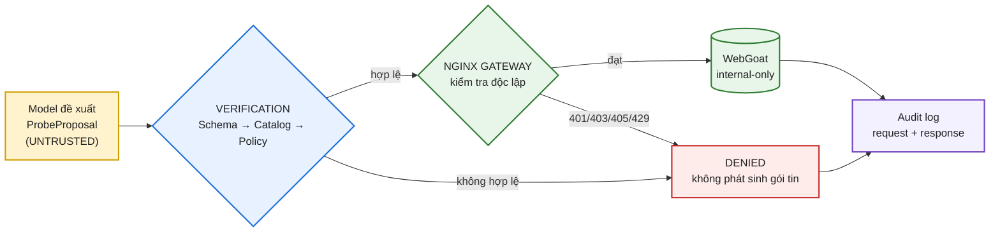
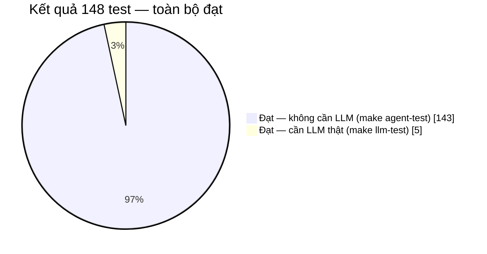
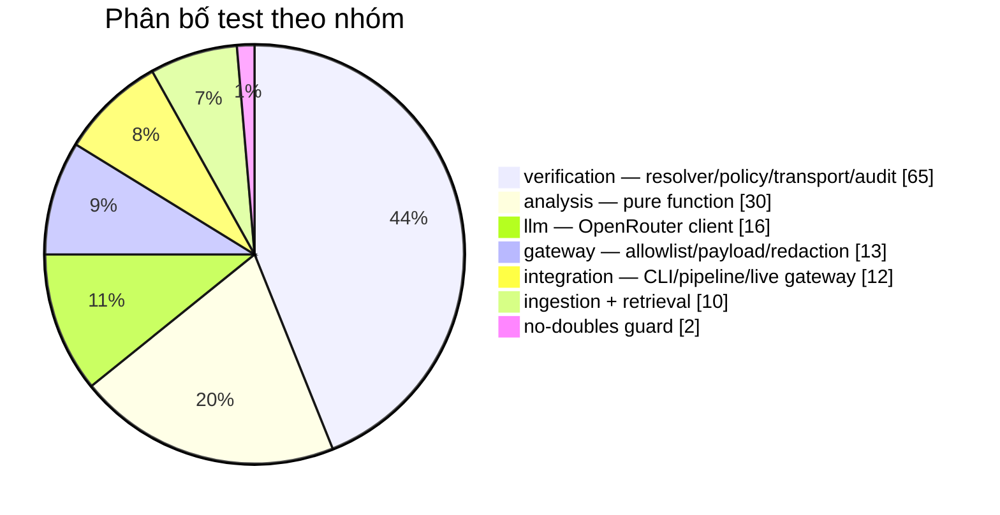

# Week 4 Report — API Gateway & Safe Test Request Tool

**Project:** Sentinel · **Branch:** `week4-cont` · **Updated:** 15/08/2026 · **Status:** Final

Toàn bộ số liệu trong báo cáo được thu thập từ các lần chạy thực tế ngày 15/08/2026; log gốc lưu tại [`reports/week-04/artifacts/`](artifacts/).

---

## 1. Setup & Scope

Tuần 4 triển khai tầng thực thi request kiểm thử an toàn giữa agent và target (OWASP WebGoat v2025.3). Hai đường truy cập được đối chiếu:

- **direct** — client → `127.0.0.1:8080` (WebGoat), không qua kiểm soát.
- **gated** — `probe-objectives.json` → `proposer.render_prompt()` (system prompt + `endpoint-catalog.json`) → model `deepseek/deepseek-v4-flash-0731` sinh một `ProbeProposal` → `probe-proposal.schema.json` → `resolver.resolve_proposal()` (phân giải lại `endpoint_id` · `method` · tên tham số · `payload_type` · giá trị header theo catalog) → `policy.validate_candidate_policy()` → `RealTransport` (origin cố định `127.0.0.1:9080`) → Nginx Gateway → WebGoat. Đây đúng là contract đang chạy trong `cli.py probe` / `make probe`.

Proposal do model sinh ra được xử lý như **untrusted data**: model chỉ được *chọn* trong danh mục đã duyệt, mọi lựa chọn đều được phân giải lại trước khi mở kết nối.

**Architectural boundary:** `gateway/` và `verification/` không import `analysis/` (Tuần 3); tích hợp với Security Analysis Agent hoãn sang Tuần 6. Ràng buộc được bảo đảm bằng test tự động (`test_no_week3_imports.py`).

---

## 2. Architecture Flow



| Component | Vị trí | Vai trò |
| :--- | :--- | :--- |
| Proposer | `verification/proposer.py`, `configs/verification/probe-objectives.json` | Chọn endpoint/template/payload trong catalog |
| Verification | `probe-proposal.schema.json` → `resolver.py` → `policy.py` | 3 lớp, không phát sinh gói tin |
| Gateway | `infra/docker/gateway/` (Nginx) | API key · allowlist · rate limit · body size, độc lập với Python |
| Target | `docker-compose.yml` | WebGoat không công bố cổng host |
| Audit log | `gateway/request_log.py` | Ghi cả ca đạt lẫn ca bị từ chối; không lưu secret |

**Invariant:** agent không được tự sinh `path`, `url`, `host`, `port`, `scheme`, **tên** header, hay payload literal.

---

## 3. Configuration Loaded

| Thành phần | Số lượng | Nguồn |
| :--- | ---: | :--- |
| Endpoint catalog | 2 | `configs/verification/endpoint-catalog.json` |
| Probe template | 3 | `configs/verification/probe-templates.json` |
| Safe payload (closed enum) | 4 | `gateway/payloads.py` |
| Operator objective | 4 | `configs/verification/probe-objectives.json` |
| JSON Schema | 4 | `schemas/` |
| Module Python (gateway + verification) | 17 · 1.507 dòng | `src/project_sentinel/` |

**Endpoint catalog** — bắt buộc có trường `source`; endpoint không có nguồn kiểm chứng không được thêm:

| `endpoint_id` | Path | Methods | Source |
| :--- | :--- | :--- | :--- |
| `ep_health` | `/WebGoat/actuator/health` | GET | `docker-compose.yml` → `webgoat.healthcheck` |
| `ep_attack` | `/WebGoat/attack` | GET, POST | `HammerHead.java:21` |

**Safe payloads** — không có nhánh code nào cho payload tự do:

| `payload_type` | Giá trị | Mục đích |
| :--- | :--- | :--- |
| `long_string` | `"A" × 1024` | Length limit |
| `special_chars` | `!@#$%^&*()'"<>;` | Sanitization cơ bản |
| `empty_value` | `""` | Empty boundary |
| `wrong_type` | `12345` | Type mismatch |

**Templates:**

| `template_id` | Endpoint | Method | Payload | Expected status |
| :--- | :--- | :--- | :--- | :--- |
| `tmpl_health_get` | `ep_health` | GET | — | 200 |
| `tmpl_attack_get` | `ep_attack` | GET | — | 200, 302 |
| `tmpl_attack_post_empty` | `ep_attack` | POST | `empty_value` | 200, 302 |

---

## 4. Requirements Traceability

Đối chiếu với mục **Tuần 4** trong đề bài (`docs/[NCUD-GPAI] VinUni x VinSOC 6-week of Project Sentinnel-1.pdf`).

### 4.1 Công việc

| # | Yêu cầu | Triển khai | Bằng chứng | Trạng thái |
| :---: | :--- | :--- | :--- | :---: |
| 1 | Đặt API Gateway trước ứng dụng thử nghiệm | Nginx tại `infra/docker/gateway/` | demo §3, §4 | Đạt |
| 2 | Tạo API key riêng cho công cụ kiểm thử | `SENTINEL_GATEWAY_API_KEY` qua header `X-Sentinel-API-Key` | demo §5 → 401 khi thiếu/sai key | Đạt |
| 3 | Chỉ cho phép endpoint trong allowlist | `configs/gateway/endpoint-allowlist.json` + Nginx `location` | demo §5 → 403/405 | Đạt |
| 4 | Python Tool gửi request GET | `tmpl_health_get`, `tmpl_attack_get` | acceptance #6 | Đạt |
| 5 | Python Tool gửi POST với dữ liệu thử nghiệm | `tmpl_attack_post_empty` | acceptance #7 | Đạt |
| 6 | Thiết lập header | `allowed_request_headers` trong catalog; resolver phân giải, executor áp dụng | 5.2 #6, #7 | Đạt |
| 7 | Đọc status code và một phần response | `status_code` + `response_preview` giới hạn 512 B | 5.4 | Đạt |
| 8 | Giới hạn số request mỗi phút | `ToolRateLimiter` 30 req/phút, burst 5 + Nginx `limit_req` | demo §7 → 429 | Đạt |
| 9 | Giới hạn thời gian chờ | Timeout mặc định 5 s, trần cứng 10 s | `test_transport.py` | Đạt |
| 10 | Giới hạn kích thước response | Cap 64 KiB, đánh dấu `truncated` | `test_transport.py` | Đạt |
| 11 | Chỉ sử dụng payload an toàn (4 loại) | `SafePayloadType` — closed enum | mục 3 | Đạt |
| 12 | Không dùng payload phá hoại | `test_safe_payloads_are_bounded_and_non_exploitative` | `unit/gateway` | Đạt |

### 4.2 Sản phẩm bàn giao

| # | Deliverable | Vị trí | Trạng thái |
| :---: | :--- | :--- | :---: |
| 1 | API Gateway hoạt động | `infra/docker/gateway/`, `docker-compose.yml` | Đạt |
| 2 | Python Tool gửi request qua Gateway | `verification/gateway_client.py`, `transport.py` | Đạt |
| 3 | Tệp cấu hình allowlist | `configs/gateway/endpoint-allowlist.json` | Đạt |
| 4 | Nhật ký request và response | `artifacts/gateway/requests.log.jsonl` | Đạt |
| 5 | Demo Agent đề xuất request và công cụ thực hiện | `scripts/demo-week4.sh` §6a (accepted) và §6b (denied) | Đạt |

### 4.3 Tiêu chí hoàn thành

| # | Tiêu chí | Kết quả kiểm chứng | Trạng thái |
| :---: | :--- | :--- | :---: |
| 1 | Không thể gọi trực tiếp endpoint bị cấm thông qua công cụ | 9/9 adversarial proposal bị từ chối, 0 gói tin (5.2); Gateway trả 403/405 (demo §5) | Đạt |
| 2 | Request đều đi qua API Gateway | WebGoat không công bố cổng host; kết nối thẳng `127.0.0.1:8080` → `OSError` (5.1 #1, demo §4) | Đạt |
| 3 | Công cụ xử lý được lỗi timeout và lỗi kết nối | `UNREACHABLE` (timeout) và `FAILED` (connection refused) — `test_transport.py` | Đạt |
| 4 | Nhật ký không lưu API key | Canary scan toàn bộ log không tìm thấy key (demo §8); `request_log.py` raise khi gặp header/body/cookie | Đạt |

**Kết luận:** 12/12 công việc, 5/5 sản phẩm bàn giao và 4/4 tiêu chí hoàn thành đều đạt.

---

## 5. Results

### 5.1 Gateway Boundary Acceptance Matrix

Nguồn: `tests/integration/test_gateway_live.py`, chạy trên hạ tầng thật.

| # | Scenario | Expected | Observed | Kết quả |
| :---: | :--- | :--- | :--- | :--- |
| 1 | Kết nối thẳng `127.0.0.1:8080`, bỏ qua Gateway | Không kết nối được | `OSError` — không có cổng host | Đạt |
| 2 | GET endpoint hợp lệ, thiếu API key | 401 | 401 | Đạt |
| 3 | GET endpoint hợp lệ, API key sai | 401 | 401 | Đạt |
| 4 | GET `/WebGoat/login` (ngoài allowlist) | 403 | 403 | Đạt |
| 5 | DELETE endpoint hợp lệ (method ngoài allowlist) | 405 | 405 | Đạt |
| 6 | GET `ep_health` qua đủ 3 lớp verification | 200, `OBSERVED` | 200, `OBSERVED` | Đạt |
| 7 | POST `ep_attack` với `empty_value` | 200/302, `OBSERVED` | `{200, 302}`, `OBSERVED` | Đạt |
| 8 | Phát 10 request liên tiếp | 429 → `RATE_LIMITED` | 429, `RATE_LIMITED` | Đạt |
| 9 | Rà soát API key trong audit log | Không xuất hiện | Không xuất hiện | Đạt |

Các mã 401/403/405/429 do **Nginx** trả, không do Python quyết định — guardrail còn hiệu lực kể cả khi tầng Python bị bỏ qua.

### 5.2 Adversarial Proposals → Denial Codes

Nguồn: `tests/unit/verification/test_resolver.py`.

| # | Proposal (giả định bị thao túng) | Denial code | Layer | Packet |
| :---: | :--- | :--- | :--- | :---: |
| 1 | `endpoint_id: "ep_invented"` — không có trong catalog | `ENDPOINT_NOT_CATALOGUED` | 2 — Resolver | 0 |
| 2 | `method: "DELETE"` | `PROPOSAL_SCHEMA_INVALID` | 1 — Schema | 0 |
| 3 | `template_id: null` | `PROPOSAL_SCHEMA_INVALID` | 1 — Schema | 0 |
| 4 | `path: "http://untrusted.invalid/"` — tự chèn URL | `PROPOSAL_SCHEMA_INVALID` | 1 — Schema | 0 |
| 5 | `parameters: {"cmd": "literal-unreviewed-value"}` | `PARAMETERS_NOT_ALLOWED` | 2 — Resolver | 0 |
| 6 | `headers: {"Host": "untrusted.invalid"}` | `RESTRICTED_HEADER` | 2 — Resolver | 0 |
| 7 | `headers: {"Accept": "application/xml"}` — ngoài enum | `HEADER_VALUE_NOT_ALLOWED` | 2 — Resolver | 0 |
| 8 | POST gắn template GET | `TEMPLATE_TUPLE_MISMATCH` | 2 — Resolver | 0 |
| 9 | `payload_type: "EMPTY"` — sai enum | `PAYLOAD_TYPE_MISMATCH` | 2 — Resolver | 0 |

Cột `Packet` không phải suy diễn: 5 ca đầu được kiểm chứng bằng cách đối chiếu Nginx access log trước/sau, xác nhận log không tăng dòng nào — bằng chứng tại biên hạ tầng, mạnh hơn đếm call trên object nội bộ.

### 5.3 Test Suite

| Lệnh | Kết quả | Thời gian | Log |
| :--- | :--- | ---: | :--- |
| `make agent-test` | `143 passed, 5 deselected` | 18,52 s | `artifacts/agent-test.log` |
| `make llm-test` | `5 passed, 143 deselected` | 93,82 s | `artifacts/llm-test.log` |
| `./scripts/demo-week4.sh` | `14 pass / 0 fail` | — | `artifacts/demo-week4.log` |
| `python -m compileall src/project_sentinel` | OK | — | — |

**148/148 test đạt** khi cộng cả hai lượt chạy.





| Nhóm | n | Đạt | Fail | Ghi chú |
| :--- | ---: | ---: | ---: | :--- |
| `unit/verification` | 65 | 65 | 0 | resolver · policy · transport · rate limit · audit · import boundary |
| `unit/analysis` | 30 | 30 | 0 | Pure function, không cần provider |
| `unit/llm` | 16 | 16 | 0 | OpenRouter client |
| `unit/gateway` | 13 | 13 | 0 | allowlist · payload · CLI · redaction |
| `integration` | 12 | 12 | 0 | Gồm acceptance matrix 5.1 |
| `unit/ingestion` + `unit/retrieval` | 10 | 10 | 0 | |
| `test_no_doubles` | 2 | 2 | 0 | Ngăn test double tái xuất hiện |
| **Tổng** | **148** | **148** | **0** | 5 test marker `llm` tách riêng do tốn token, không deterministic |

Năm test phụ thuộc model thật, đều đạt:

| Test | Vai trò |
| :--- | :--- |
| `test_proposer.py::test_generate_probe_proposal_with_real_openrouter` | Model thật sinh proposal hợp lệ schema và resolve được trong catalog |
| `test_openrouter.py::test_real_openrouter_live_call` | Client gọi được OpenRouter |
| `test_analyzer.py::test_analyze_finding_group_live` | Phân tích một finding group với model thật |
| `test_cli.py::test_cli_analyze_live` | CLI `analyze` end-to-end |
| `test_analysis_pipeline.py::test_pipeline_live_valid_findings` | Pipeline end-to-end |

### 5.4 Live Run Evidence

`make probe OBJ=obj-health-check` → `artifacts/verification/run-summary.json`:

| Field | Value |
| :--- | :--- |
| `objective_id` | `obj-health-check` |
| `decision` | `PLANNED` |
| `status` / `status_code` | `OBSERVED` / `200` |
| `response_bytes_observed` | 516 bytes, `truncated: false` |
| `response_preview` | `{"status":"UP","components":{"db":{"status":"UP",…` |
| `elapsed_seconds` | 2,67 (toàn bộ luồng, gồm lần gọi model) |
| `elapsed_ms` trong audit record | 3,87 (riêng request qua Gateway) |

`make probe OBJ=obj-unmapped-finding` (objective không ánh xạ được endpoint nào) trả `INCONCLUSIVE`, không phát sinh request — xác nhận việc từ chối là một kết cục hợp lệ, không phải lỗi.

Audit log `artifacts/gateway/requests.log.jsonl` ghi đủ provenance (`request_id`, `objective_id`, `proposal_id`, `endpoint_id`, `policy_decision`, `status`, `elapsed_ms`, `error_class`) và không chứa API key, header map hay request body — `request_log.py` raise ngoại lệ khi gặp các trường này. Mẫu bản ghi: `artifacts/audit-log-sample.jsonl`.

### 5.5 Demo Script

`./scripts/demo-week4.sh` — **14 pass / 0 fail**, gồm 9 phần:

| § | Nội dung | Kết quả |
| :---: | :--- | :--- |
| 0–1 | Preflight; liệt kê file đã implement | OK |
| 2 | Contract guards — no doubles, no Week 3 coupling | OK |
| 3 | Khởi động Docker gateway + webgoat | OK |
| 4 | Cách ly target — WebGoat chỉ trên mạng nội bộ Docker | OK |
| 5 | Guardrail tại Gateway — API key / path / method | 401, 403, 405, 200 đúng kỳ vọng |
| 6 | Agent → IAM → Gateway | 6a accepted → `OBSERVED`; 6b denied → `ENDPOINT_NOT_CATALOGUED` |
| 7 | Rate limit | `200 ×6 → 429 ×4`, tool ánh xạ `RATE_LIMITED` |
| 8 | Audit log + canary scan | Không tìm thấy API key, không có header/body/cookie |

### 5.6 Assessment

Nếu bỏ tầng verification, mọi proposal ở 5.2 đều hợp lệ về cú pháp: model có thể chèn URL ngoài, tự đặt header `Host`, hoặc truyền tham số chưa duyệt. Cả 9 ca đều bị chặn trước khi mở kết nối; 4 ca còn lại (thiếu key, sai key, sai path, sai method) vẫn bị Nginx chặn kể cả khi tầng Python bị bỏ qua. Hiệu lực của guardrail không phụ thuộc vào việc model hoạt động đúng, cũng không phụ thuộc vào giả định tầng Python không có lỗi.

---

## 6. Deliverables

| Hạng mục | Vị trí |
| :--- | :--- |
| Gateway (Nginx + template) | `infra/docker/gateway/`, `docker-compose.yml` |
| Python Tool | `src/project_sentinel/verification/`, `src/project_sentinel/gateway/` |
| Allowlist / catalog / template / objective | `configs/gateway/`, `configs/verification/` |
| JSON Schema | `schemas/probe-proposal.schema.json`, `verification-plan`, `verification-result` |
| Audit log | `artifacts/gateway/requests.log.jsonl` |
| Demo script | `scripts/demo-week4.sh` |
| Test suite | `tests/` — 148 test |
| Evidence logs | `reports/week-04/artifacts/` |
| CI | `.github/workflows/security-scan.yml` (+ job `nightly-llm`) |

---

## 7. Known Limitations

| # | Limitation | Đánh giá |
| :---: | :--- | :--- |
| 1 | Allowlist khai báo ở 2 nơi (Nginx view và agent view) | Có test xác nhận 2 file thống nhất, nhưng vẫn phải sửa thủ công cả hai |
| 2 | Payload cố định 4 loại | By design — đánh đổi là không hỗ trợ dynamic fuzzing |
| 3 | Catalog chỉ 2 endpoint | Phạm vi hẹp; đổi lại không có route do model tự suy diễn |
| 4 | Phụ thuộc Docker, không có offline mode | By design — thiếu container thì test fail kèm hướng dẫn, không skip |
| 5 | `response_preview` chưa vào bất kỳ prompt nào | By design — prompt injection surface, thuộc Tuần 5 |

---

## 8. Reproduce

Dependency khai báo đủ trong `pyproject.toml` và `requirements.txt` (sinh từ `uv export --locked`); không cần cài tay gói nào.

```bash
git submodule update --init --recursive     # WebGoat submodule, bắt buộc
python3 -m venv .venv && source .venv/bin/activate
pip install -e '.[dev]'                     # hoặc: pip install -r requirements.txt
cp .env.example .env                        # SENTINEL_GATEWAY_API_KEY, LLM_API_KEY

make gateway-up                             # Gateway + WebGoat, chờ health check
make agent-test                             # 143 test, không tốn token
make probe OBJ=obj-health-check             # Model đề xuất -> verify -> execute
make probe OBJ=obj-unmapped-finding         # Ca từ chối hợp lệ
./scripts/demo-week4.sh                     # Demo đầy đủ, 14 acceptance check
make llm-test                               # 5 test cần LLM_API_KEY
make gateway-down
```

CI (`.github/workflows/security-scan.yml`) chạy đúng luồng này với API key sinh ngẫu nhiên mỗi lần; job `nightly-llm` chạy `make llm-test`.

---

## 9. Conclusion

Tuần 4 khép lại bề mặt rủi ro lớn nhất của một security agent: khả năng phát sinh request tùy ý. Proposal phải qua 3 lớp verification cục bộ trước khi mở kết nối, rồi Nginx kiểm tra độc lập lần nữa.

Kết quả nghiệm thu ngày 15/08/2026:

- **12/12 công việc · 5/5 sản phẩm bàn giao · 4/4 tiêu chí hoàn thành** theo đề bài đều đạt.
- **9/9 adversarial proposal** bị từ chối với 0 gói tin ra mạng.
- **9/9 acceptance scenario** tại biên hạ tầng đạt; demo script **14/14 check** đạt.
- **148/148 test** đạt (143 không cần LLM, 5 cần model thật).
